## Introduction

Recently, the general public has become more aware of software supply chain issues due to an increase in widespread incidents and compromises orchestrated by multiple threat actors around the world, as shown in Figure 1. In particular, it is worth highlighting the group known by [the pseudonym "TeamPCP" and other aliases][malwarepedia_about_teampcp], which disrupts the open-source landscape and software companies. According to [aggregated sources][aggregated_sources_about_teampcp], their key campaigns create a chain reaction where one compromise leads directly into the next one, illustrating [the Cyber Kill Chain][cyber_kill_chain_definition] of attacks and [the Swiss Cheese model][swiss_cheese_model_definition] of failures. I don't want to list out every detail related to them, because there are plenty of cybersecurity firms that have already published comprehensive reports. You can also use LLMs and GenAI services to aggregate such well-documented information and ask details about their methodologies, historical implications or events, attack vectors and surfaces. 

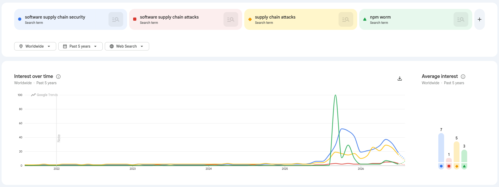

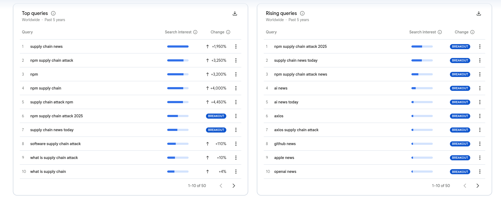

_Figure 1. These charts display Google Trends 2026 statistics on software supply chain topics and related terms, filtered for worldwide search traffic over the past five years._

From a broader perspective, the modern economy is service-oriented and highly interconnected in the global supply chain, where everyone relies on each other. Hence, engineers can mitigate issues of resource constraints (e.g., schedule, personnel, risks, requirements, finance, and qualifications) by integrating external dependencies and reusing code as outsourcing for common problems during the implementation and maintenance of IT products. Software supply chain attacks aim to exploit such trust factors and mutual dependencies, but at a much faster rate and scale than physical ones. This publication explores the problem through a case study of TeamPCP group, demonstrates systemic flaws from Figure 2, and develops ways how to improve the current cybersecurity posture.

_Figure 2. Meme about the state of software supply chain security vs. attacks._

## Operations and relationships of TeamPCP

TeamPCP began their public operations by exploiting React2Shell vulnerability and targeting misconfigured cloud-hosted instances. Later in early 2026, they gained widespread recognition for a series of Shai-Hulud attacks (e.g., "1.0", "2.0", "mini") on package repositories (e.g., NPM, PyPI, Cargo). Around that time, TeamPCP started collaborating with the ShinyHunters threat actor group on Figure 3, who revived [BreachForums][breachforums_history] after [the FBI arrested the original forum creator in 2023][fbi_arrested_original_creator_of_breachforums]. ShinyHunters is known for conducting ransomware activities to profit from various companies and platforms (e.g., their [recent data breach of the Canvas LMS][data_breach_of_canvas_lms]), as well as providing ransomware-as-a-service and malware-as-a-service to other black-hat actors. Previously, [criminal reports indicated that several of their initial members were from Europe][shinyhunters_member_from_france], but they operate in a decentralized way, acting more as a cybercriminal brand.

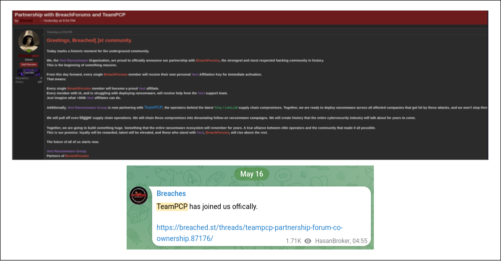

_Figure 3. Screenshots showing relationships between BreachForums and TeamPCP. They have Tor `.onion` websites with multiple mirrors (breached.st and breachforums.cz are their old public domains) and Telegram channels (t.me/s/bfsup and t.me/s/breaches). Not all provided links are currently active, so you can check their historical captures from web.archive.org for educational purposes._

Figure 4 demonstrates [the "Tactics, Techniques, and Procedures" (TTPs) of TeamPCP][ttp_mitre_teampcp] in details, in which patterns of their attacks can be summarized into three key components:
1. Deploying sophisticated multi-stage payloads of malware (i.e., mostly computer worms) and lateral movement through alternative vectors, while constantly adapting to bypass security controls.
1. Establishing persistence on compromised instances (e.g., systemd services) orchestrated from Command and Control (C2) infrastructure to support various operational objectives (e.g., Monero/XMR cryptojacking, using computing power, deploying C2 relays/botnet, internal pivot points, and remote access trojans).
1. Self-replication and propagation across software ecosystems leveraging compromised resources and harvested data (including credentials, accounts, [cryptocurrency wallets][trust_wallet_shai_hulud_drained], environment tokens, access keys, raw data, and other secrets) from infected systems and hijacked users, allowing the malware [to spread further and release malicious packages][ox_security_mini_shai_hulud_example] or their versions on behalf of legitimate maintainers/contributors.

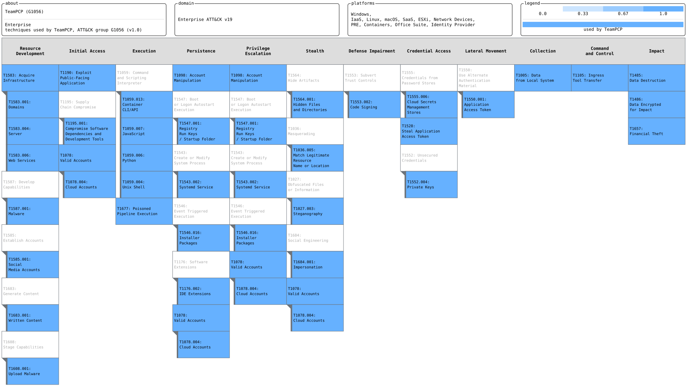

_Figure 4. Export from MITRE ATT&CK Navigator about TeamPCP with unannotated sections being hidden from the picture._

They are not only financially motivated but also appear to be driven by various other intents, because they do not make any direct demands of victims unlike [in regular ransomware operations][statistics_about_ransomware_in_early_2026]. For example, they requested only 50 thousand dollars for a single buyout of [a data breach involving around 4 thousand internal GitHub repositories][leak_of_internal_github_repositories] and declared that it was not an act of ransomware, as captured in Figure 5. Even if we assume they sell it in bulk to multiple buyers, this amount remains insignificant in comparison to [the Vercel internal data breach with a price tag of 2 million dollars on same BreachForums][report_about_vercel_data_breach_on_breachforums].

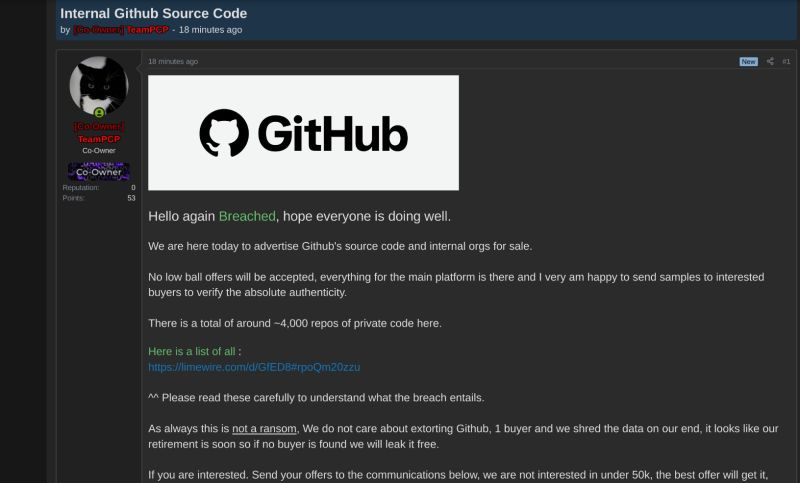

_Figure 5. Screenshot from BreachForums with [TeamPCP's post about their GitHub breach][teampcp_post_about_data_breach_of_4000_internal_github_repositories], which they carried out in a short time window by compromising: [TanStack packages][tanstack_packages_compromise] -> [Nx Console VSCode extension][nx_console_vscode_extension_compromise] -> [GitHub employee with auto-update turned on in VSCode](https://x.com/github/status/2056949168208552080)._

Such incidents are critical threats to the entire open-source ecosystem and related companies, as there could be still undetected "sleeper agents" and unknown "ticking time bombs" as well. Participants of TeamPCP have already gathered significant experience and infrastructure assets from these operations, giving them strong leverage overall. This is particularly dangerous, as sources report [their connection to Russian actors from the VECT group][teampcp_cooperates_with_shinyhunters]. Moreover, [Microsoft Threat Intelligence][microsoft_report_about_mini_shai_hulud] and [Google Wiz][google_wiz_report_about_mini_shai_hulud] reported on context-aware logic in Mini Shai-Hulud (e.g., country, location, timezone, and metadata) that ignores systems with a RU locale and executes the "rm -rf /" command with a 1/6 chance on systems from Israel or Iran, as shown in Figure 6.

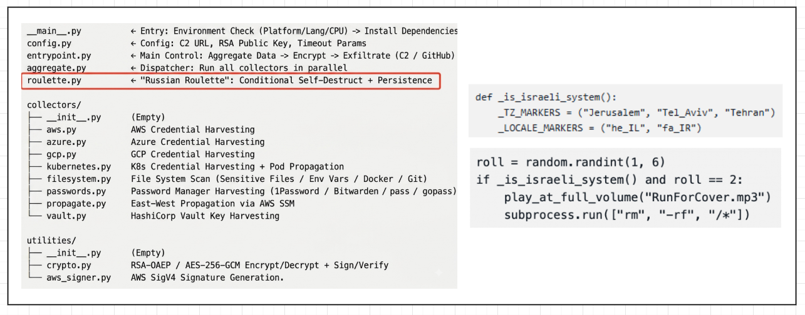

_Figure 6. Source code analysis by Chinese researchers suggests that [the threat actors may not have actual national interests][china_about_teampcp_russian], using this as a false flag. Personally, I disagree with this position, because TeamPCP left deliberate traces on compromised instances, such as [Russian music like the song "Uebok (Gotta Run)" by Instasamka][teampcp_instasamka_russian_music_hint], and used similar [target-specific mechanics in CanisterWorm][canisterworm_iran_specific_logic]_.

These cases actually indicate a possible connection with Russia, not a simple distraction for the public or a coincidence. Their direct approach to action is kinda similar to [APT (Advanced Persistent Threat)][apt_group_definition] like North Korea's Lazarus Group, which operate without negotiation and carry out operations to completion under a political agenda (e.g., [exfiltrating 1.5 billion dollars from Bybit][lazarus_group_exfiltrated_billions_from_bybit]), as pictured in Figure 7. I suspect that TeamPCP is not a formal APT operating directly as Russian government state actors, but instead function as contractors on a temporary basis or collaborate with recruited and independent Russian/Slavic threat groups. For instance, Tor Zireael demonstrated in his video [the internals of wild black-hat hackers from Russia][internals_of_wild_russian_blackhat_hacker_forums] (including the Russian-speaking and Slavic space), who adhere to the rule of "we don't abandon our own, and we don't attack our own", meaning that any hacking operations are discouraged against the CIS (Commonwealth of Independent States) sphere of influence or within Russia's domestic infrastructure. Of course, it is not a noble morality or ethics, because otherwise they would be arrested or eliminated, so the state permits them to operate only against external targets whom they refer as "the Collective West". Some of them may receive direct state sponsorship or structural preferences from government-military contracts by execution of specific tasks (e.g., cyber operations against Ukrainian targets). This represents their systemic approach for causing harm and disruption across various sectors using [hacking groups, internet trolls, biased pro-Russian news, and spreading state superiority propaganda][cybernews_investigation_about_russian_hacking_group].

_Figure 7. Meme about the negotiation process with black-hat hackers._

Particularly, it is a deeply concerning issue for me, given that our government cooperates with and trusts the Russian Federation in the construction of a nuclear power plant and other critical infrastructure in Kazakhstan, which could come with potential backdoors. From my point of view, Russia is an unreliable partner that only prioritizes its own well-being and is willing to betray anyone for its own benefit and reckless ambitions, such as starting a war (the same can be said about the US). Interestingly, based on my experience working alongside government entities with their intelligence agents, who are predominantly relatively young men aged 20 to 40, they actively cooperate with Belarus and the Russian Federation like according to Soviet-era playbooks. This trend persists despite the fact that our general population does not support the Russo-Ukrainian war and has a large ethnic Ukrainian diaspora stemming from the Soviet era, as well as new arrivals who have come since 2022. Moreover, Kazakhstani cybersecurity organizations do not tend to regularly publicly mention about or review recent global incidents of software supply chain attacks, which indicates hidden internal dynamics, misplaced priorities, or basic ignorance.

## The industry issues exposed by recent attacks

### Blame processes and systems, not only attackers

These security incidents have revealed valuable insights for self-reflection within the global IT community and raised general situational awareness through various publications or post-mortems (from Google Wiz, SafeDep, Snyk, Ox Security, and others). Recently, it was revealed that [the Australian Federal Police with the FBI arrested two members of TeamPCP](https://krebsonsecurity.com/2026/08/two-alleged-teampcp-hackers-arrested-in-australia/), young men aged 21 and 23, who now potentially face 10 to 20 years in prison. However, [I think that we should not only blame threat actors](https://lnkd.in/p/dNA6b3Sv) or specific individuals, as these are systemic failures where responsibility actually lies with different parties and institutions. Because there will be even more new threat actors, as TeamPCP unleashed a "Pandora's box" by [sharing Shai Hulud worm sources in open source and started a mini-competition around it](https://unit42.paloaltonetworks.com/cyber-extortion-economy/) to introduce their methodologies and playbooks on Figure 8.

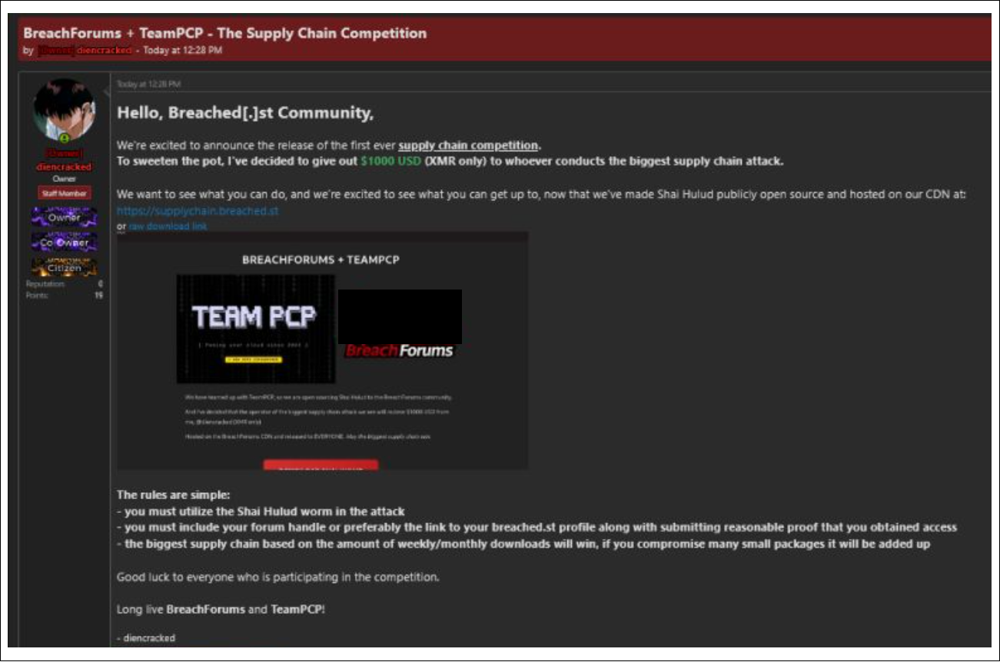

_Figure 8. BreachForums post announcing the open-sourcing of TeamPCP's Shai Hulud worm and an incentivized community competition targeting software supply chains._

Broader social factors shape the [motivations of black-hat actors][motivations_of_black_hat_actors], who want to fight back against financial pressures and the devaluation of human dignity in the current political-economic system. For example, Microsoft [refused to pay a researcher and began blocking him][microsoft_refused_to_pay_security_researcher], literally turning a white-hat into a black or gray one. Usually, bug bounty programs attempt to mitigate that by fostering mutual cooperation among security researchers, organizations, and platforms (such as HackerOne, Bugcrowd, Google VRP, MSRC, and TumarOne). I have experience with these processes, where each platform has a defined set of rules that outlines acceptable vulnerability types or attack vectors, and requires participants to adhere to coordinated vulnerability disclosure principles or comply with an NDA (Non-Disclosure Agreement) for a specified period, as illustrated in Figure 9.

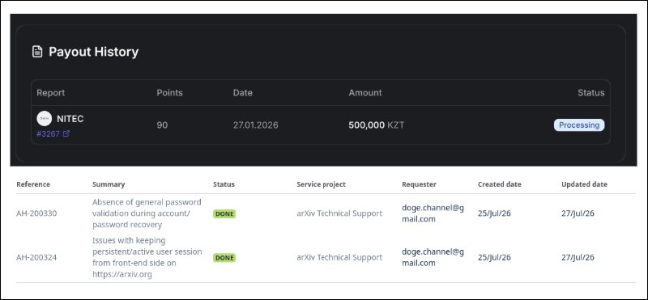

_Figure 9. Screenshots from [my LinkedIn publication about earning bug bounties on TumarOne][tumar_one_first_bounty_linkedin] and having an active user position._

### Lack of proactive security and adaptation to threats

On the other hand, passive defensive measures remain far more common than proactive ones in the industry, despite them being largely ineffective against indirect attacks. If we only focus on detecting basic indexed artifacts and tracking short-lived indicators of compromise, this limited kind of cyber threat intelligence cannot preemptively address threats or adapt dynamically under high-pressure conditions, as joked in Figure 10. Therefore, we should take into account [the concept of the Pyramid of Pain][concept_pyramid_of_pain], which states that "the amount of pain you cause an adversary depends on the types of indicators you are able to make use of" and emphasizes the importance of [behavioral threat hunting][ttp_and_threat_hunting_techniques]. Moreover, blue and red teams should collaborate by sharing experiences and conducting research to become "purple". For instance, the US has [allowed its cybersecurity firms to combat against foreign threat actors][us_allowed_offensive_operations], showing the principle of "the best defense is a good offense" by mastering both defensive and offensive sides.

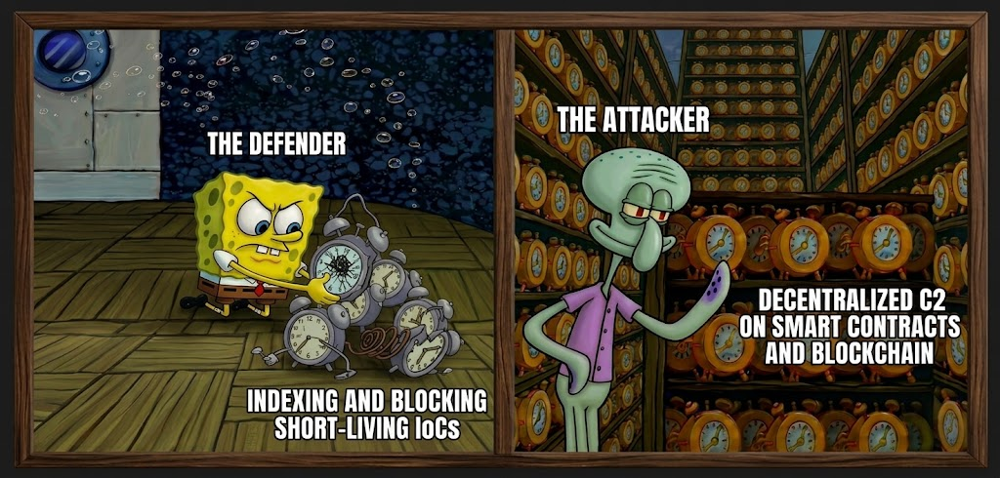

_Figure 10. Meme about resilient attackers who constantly rotate resources (e.g., [GlassWorm on Solana][glassworm_on_solana], [EtherRAT][ethers_rat] and [Tsundere botnet](https://www.kaspersky.com/about/press-releases/cute-but-deadly-kaspersky-reveals-the-tsundere-botnet-that-plays-hot-and-cold-with-windows-users) on Etherium, [ChainDrop on Github commits][chaindrop_github_commits], [C2 communications through social networks][c2_communications_social_networks], and [other С2 infrastructure or data exfiltration pipelines on semi-legitimate traffic][c2_on_semi_legitimate_traffic])._

### Inevitability of physical and digital supply chain attacks

Software supply chain attack and computer worms are [well-known vectors seen in historical events][historical_events_of_supply_chain_attacks], but they are still frequently missed by security authorities. Back in 1988, the Morris worm [brought down 10 percent of the proto-internet](https://youtu.be/8UBv8pWH3Kw) due to software flaws, configuration weaknesses, and the naive assumption that all participants were good actors. History repeated itself, as TeamPCP exposed the same principles of unreliable trust relationships and gaps in cybersecurity, but within globalized software ecosystems in which any package can be compromised by unknown actors and rapidly propagated, as shown in Figure 11.

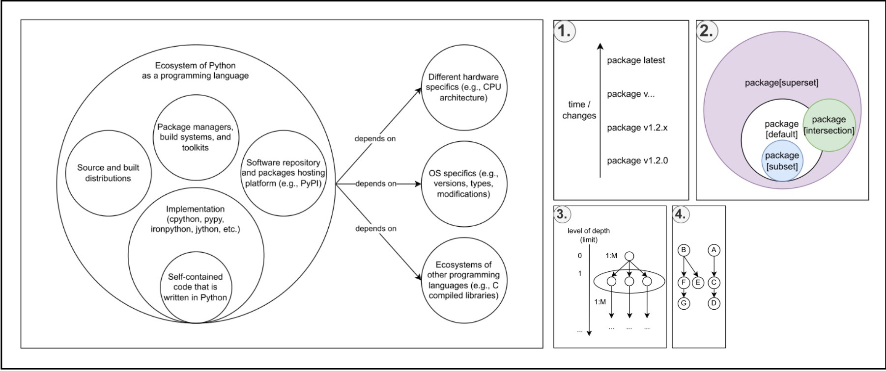

_Figure 11. Ecosystem of the Python programming language from the perspective of dependencies (on the left side). Elements of dependency theory (on the right side): (1) Version constraints. (2) Dependency groups (concept from set theory). (3) and (4) Nested dependency graph (concept from graph theory) with direct and transitive ones ("1:M" as "one to many" relationships and other types of relations between them)._

Issues of supply chains extends beyond the digital space into the physical one, from which we can get valuable insights and map them onto the IT sphere. For example, only using filters on a faucet cannot save you for a long period from poisoned water in a well, so instead you should have a defense-in-depth approach across all elements (i.e., wells, pipes, and filters). It means that adopting defensive measures on endpoints is a temporary or partial workaround, because there are several vulnerable points of failure for potential attacks, as highlighted in Figure 12.

_Figure 12. The lifecycle and attack surface of the software supply chain: (1) Sources, as primary and secondary repositories (e.g., packages, source code, containers), which are vulnerable to signature spoofing, platform compromises, [phishing or account theft][chalk_npm_phishing_of_maintainer_account], and typosquatting. (2) Transportation, as delivery pipelines and related infrastructure (e.g., [the Megalodon attacks on GitHub CI/CD actions][megalodon_attacks_on_github_ci_cd_actions], [bypassing SLSA provenance][case_of_bypassing_slsa_provenance], [DNS hijacking/backdoor][golang_dns_hijacking_backdooring], etc.). (3) Endpoints, involving users or systems that utilize the received artifacts, package management systems, and tooling (e.g., post-install and pre-install scripts, [vscode tasks and hooks](https://thehackernews.com/2026/06/hijacked-npm-and-go-packages-use-vs.html), [git repository hooks](https://andrii.ro/blog/investigating-malware), [claude config files](https://safedep.io/config-files-that-run-code/))._

Actually, software dependency risks also occurs within distributions of supplementary content where malware/grayware is disguised as "legitimate" software on trusted platforms, such as:
- Baiting regular users to download specially crafted [games](https://youtu.be/vq__yP1fPCI) and [workshop content](https://www.kaspersky.com/about/press-releases/kaspersky-discovered-a-malware-campaign-targeting-steam-users-through-infected-wallpaper) with hidden payloads on Steam, alongside [uncurated user-created modifications](https://research.checkpoint.com/2025/minecraft-mod-malware-stargazers/) and [modpacks](https://support.curseforge.com/support/solutions/articles/9000228509-june-2023-infected-mods-detection-tool) in Minecraft.
- Exploiting the factor of vendor fragmentation in [third-party/utility software repositories in the open-source ecosystem](https://repology.org/repositories/graphs) due to the absence of a proper verification process (recurring cases in aurpackages [1][archlinux_1], [2][archlinux_2], [3][archlinux_3], [4][archlinux_4]) amid the growing transition of users from Windows to Linux (influenced by [gaming communities of Steam Deck and Steam Machine](https://store.steampowered.com/hwsurvey/Steam-Hardware-Software-Survey-Welcome-to-Steam), privacy or general issues in Microsoft products, and [EU digital sovereignty policies](https://www.youtube.com/watch?v=hmGAId0J2Lc)).
- Targetting critical open-source infrastructure on which proprietary solution heavily rely (e.g., GDB, GCC, LLVM, CPython, Rust) and sparsity of cybersecurity toolkits (e.g., [security analysis bypass of LiteLLM package](https://www.infostealers.com/article/largest-ai-supply-chain-breach-of-2026-litellm-hack-impacts-thousands-of-global-enterprises-claim-your-ethical-disclosure/) due to [Trivy compromise][trivy_security_toolkit_compromise], HashiCorp analysis about [the need for cybersecurity consolidation of tools](https://www.hashicorp.com/en/blog/the-risks-of-cybersecurity-tool-sprawl-and-why-we-need-consolidation), injection of malware [into CVE PoC scripts targetting researchers](https://www.bleepingcomputer.com/news/security/thousands-of-github-repositories-deliver-fake-poc-exploits-with-malware/)).

The extensive rush toward AI adoption in recent years is leading to its supply chain abuse (including harness wrappers, agent skill files, inference engines, configuration files, poisoned datasets, and underlying software libraries/packages) and [AI-targeted attacks](https://atlas.mitre.org/matrices/ATLAS-matrix). Firsly, [agentic systems are vulnerable to control takeovers and hijacking](https://claude.com/blog/zero-trust-for-ai-agents) because inexperienced users usually operate without isolated environment or within unrestricted/unsafe autonomous mode. For example, [typosquatting and prompt injection techniques](https://www.ox.security/blog/ai-attacks-are-outpacing-static-security-tools/) can induce the system to download malicious packages (or any other action) and to trick user that does not review produced outputs. On top of that, defenders tend to over-rely on AI-integrated security automation or grant them too much agency, so adversaries use [anti-AI methods to bypass and manipulate such systems](https://socket.dev/blog/npm-package-uses-prompt-injection-and-token-flooding-to-disrupt-ai-malware-scanners). Secondly, [research from Anthropic in 2024](https://arxiv.org/pdf/2401.05566) and [recent findings by security practitioners](https://www.theregister.com/ai-and-ml/2026/07/16/researcher-poisons-open-weight-ai-model-for-under-100/5273880) demonstrate that open-weight models hosted on platforms like Hugging Face can deliberately poisoned to have hidden triggers/backdoors. Historically, defenders could easily [scan for malware injections hidden in small model binaries](https://www.hiddenlayer.com/research/weaponizing-machine-learning-models-with-ransomware), but auditing modern large models over 10 GB has become impractically resource-intensive for standard security tools, leaving local model weight verification and reverse engineering of "black boxes" as ongoing research areas. Thirdly, [AI-assisted attackers have a high execution speed](https://www.antiy.net/p/sand-dune-collapse-in-the-ai-era/) when it comes to realizing and implementing their operations, learning from mistakes, pivoting, and iterating. This was statistically demonstrated by the multitude of Linux kernel [zero-day vulnerabilities discovered by LLMs][linux_kernel_zero_days_discovered_by_frontier_models] and [reconstructed from CVE descriptions](https://cloud.google.com/blog/topics/threat-intelligence/ai-vulnerability-exploitation-initial-access) without access to an actual PoC. Therefore, researchers from Canada developed a [PoC for an AI-driven worm](https://arxiv.org/pdf/2606.03811) that dynamically adapts to encountered targets within the laboratory-simulated environment shown in Figure 13, featuring partially deliberately vulnerable virtual machines and emulators to imitate a typical enterprise scenario with a heterogeneous infrastructure of legacy unpatched devices and services. Rather than generating zero-day exploits, the system targeted known attack vectors, achieving a 44% overall success rate across 15 simulation runs during a seven-day period. At its core, it operated as an agentic system driven by a local language model, executing cyber kill chain phases (switching between discovery and exploitation), testing various attack paths as attack trees or graphs, and rerunning execution loops. Furthermore, it had self-replication swarm capabilities, pooling computational resources from compromised instances for distributed inference and clonning itself to remain decentralized, resilient, and self-sustaining. It lacked covert operational mechanics and defense evasion techniques, such as applying [polymorphic principles to dynamically alter signatures and scripts against hardened monitoring](https://cloud.google.com/blog/topics/threat-intelligence/threat-actor-usage-of-ai-tools). Although the authors intentionally kept their PoC closed-source due to safety and ethical constraints, similar [AI-driven swarm incidents are already occurring in the wild](https://metr.org/blog/2026-08-26-openai-hugging-face-incident-investigation/). While security experts have yet to establish definitive defensive standards against such worms, I see potential in using adversarial prompt injections and defensive honeypots, as an offensive agent could be tricked into fetching a false credential leak containing a script or zip bomb to disrupt the process and temporarily kill the agent, or be misdirected by opposing defensive agents designed to counter it.

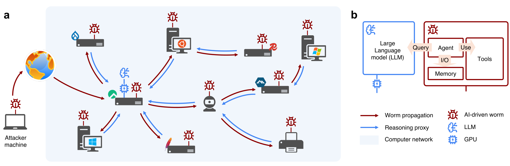

_Figure 13. Source text from https://cleverhans.io/worm.html about the figure: "An AI-driven worm propagates across a heterogeneous network by parasitically acquiring computational resources for autonomous reasoning. (a) The worm spreads through a network containing servers, workstations, and IoT devices. Red arrows show propagation between compromised machines, while blue arrows show reasoning queries from low-compute machines to compromised GPU nodes. (b) The worm combines a single-GPU LLM with an agentic framework for recursive reasoning, memory management, and tool use against target machines"._

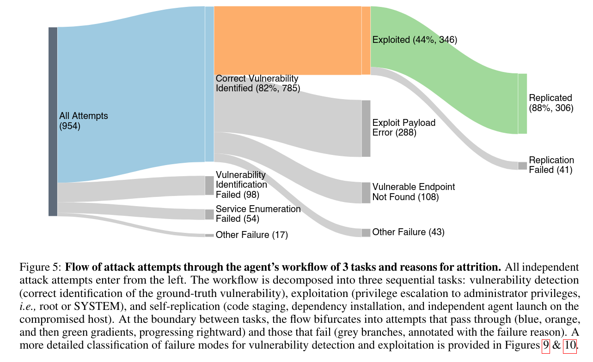

_Figure 14. Flow of AI-driven worm attack attempts from the research._

## Next major steps to improve the current situation

### Financial uncertainties in open source

According to [statistics from Harvard University and the Linux Foundation in 2024](https://www.linuxfoundation.org/blog/the-economic-value-of-open-source-software-contributions), the estimated supply-side value of widely used open-source software would cost around 4.2 billion dollars to recreate, whereas the demand-side value derived by companies adopting it was estimated between 2.6 trillion dollars and 13.2 trillion dollars. [Particularly as of 2025](https://www.linuxfoundation.org/blog/the-state-of-open-source-software-in-2025), open-source funding has been growing in sectors of operating systems, cloud toolkits, AI and machine learning, web applications, and database with data management. However, funding in open-source is distributed disproportionately among regions and projects, leaving some overfunded while others remain severely underfunded. This issue is particularly critical given that data from [Black Duck’s 2026 OSSRA Report reveals that 98% of audited commercial codebases contain open-source components](https://www.blackduck.com/resources/analyst-reports/open-source-security-risk-analysis.html) drawn from an ecosystem of over 10 million open-source projects, demonstrating that any of these dependencies can become a point of failure or a high-value target for supply chain attacks. They also showed that 64% of open-source components in an average codebase are actually transitive dependencies pulled in automatically by direct dependencies. Moreover, there were critical vulnerabilities within open-source software repositories (such as [the tampering incident on python.org](https://blog.python.org/2026/06/mitigated-api-bypass-for-download-metadata-python-dot-org/) or [the attempted takeover of GNU Savannah](https://www.fsf.org/news/statement-regarding-gnu-savannah-security-reports)) due to a lack of funding for security, which can expose downstream users to significant risks.

Open source emphasizes transparency and collaborative work, but it is not about guaranteed free labor and free products. Relying on voluntary donations creates deep instability for maintainers because funding operates like charity rather than a reliable revenue stream, leading to no obligations and no warranties from any side. To sustain modern software infrastructure, the ecosystem must adopt into fair and enforceable commercialization models, as explained in Figure 15:
1. [The Open-Core][open_core_model] and source-available models are well illustrated by companies like Trezor, which commercialize hardware crypto wallets while keeping both their firmware and software applications open-source for the community.
1. Subscription models on software repositories built on a [Perpetual Fallback License][perpetual_fallback_license] that can incorporate ownership rights by never restricting access to versions acquired at the time of purchase or older releases once the subscription expires. So, users pay for ongoing maintenance, product quality, and continuous access to the latest updates and support.
1. Tokenization models applied to repository and platform operations enable granular rate limiting and usage monitoring to track down and restrict actors who spam or consume disproportionate infrastructure resources

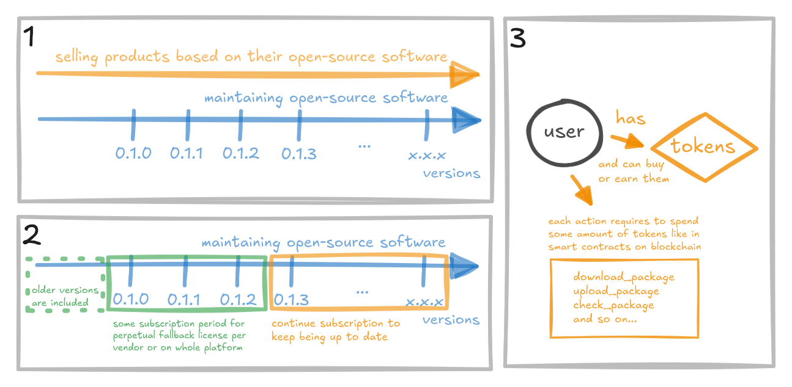

_Figure 15. Comparing alternative commercialization models while keeping core principles of open-source._

### Security of supply chains and ecosystems

Although following to [software composition analysis and dependency management principles remains essential](https://www.ic3.gov/CSA/2026/260702.pdf) against threats, they are no longer enough to handle [the sheer volume of software published to registries](https://www.fortinet.com/blog/threat-research/malicious-packages-across-open-source-registries), as provided in Figure 16. Software ecosystems represent complex networks of social relationships and social contracts governed by trust dynamics, where developers continuously rely on other market participants. It is hard to trust to unknown or anonymous actors who carry no potential accountability for their actions, so KYC (know your customer) procedures are made to enforce transparent identity verification across all parties. Moreover, we should turn toward [more explicit and trustless verification models](https://jfrog.com/blog/npm-v12-from-implicit-to-explicit-trust/).

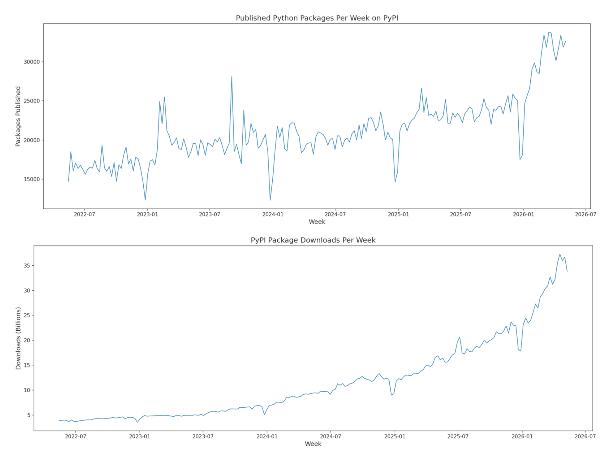

_Figure 16. [The charts illustrate a major acceleration in PyPI activity from 2022 through 2026](https://rushter.com/blog/pypi-packages/), with weekly package downloads growing exponentially from ~4 billion to over 35 billion. Weekly published packages also surged into 2026, breaking past 30,000 packages per week despite periodic holiday downturns around January._

Another important aspect is preventive security, which I suggested in [my dissertation and related research][my_dissertation_and_corresponding_research] for software sources. This works as a quality gate for repositories to restrict or delay compromised packages from spreading quickly, reducing damage and making the whole ecosystem resilient. Early forms of this concept are already visible as cooldowns and canary releases in [VS Code Marketplace](https://thehackernews.com/2026/06/vs-code-adds-2-hour-extension-auto.html) and [GitHub Dependabot](https://github.blog/security/supply-chain-security/the-case-for-a-cooldown-why-dependabot-now-waits-before-issuing-version-updates/). Furthermore, software checks need to be continuous rather than one-time or simple set of tests like atomic red team and static emulation plans, cybersecurity teams should [simulate entire organizations using digital twins](https://cacm.acm.org/blogcacm/the-power-of-digital-twins-in-cybersecurity/) with multiple AI agents to lower manual work and [improve detailed detection engineering](https://neo4j.com/blog/security/graphs-cybersecurity-knowledge-graph-digital-twin/), as shown in Figure 17.

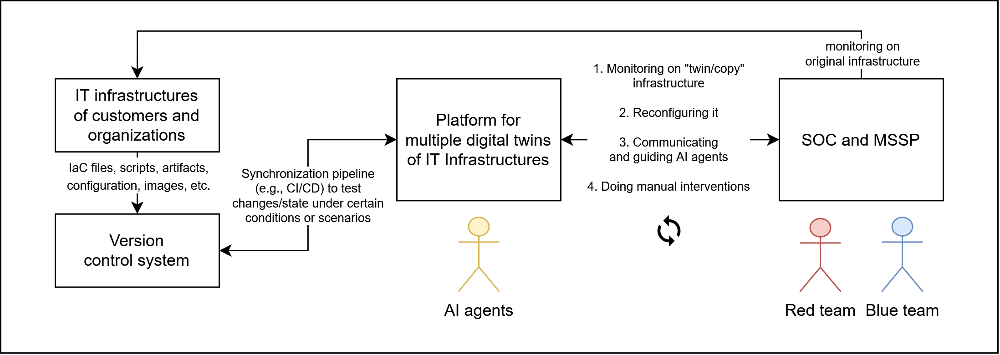

_Figure 17. Continuous security with AI agents within digital twins of IT infrastructures._

There will be a movement in the industry toward decentralization and alternative forms of source code hosting, against using centralized commercial platforms like GitHub. For example, Europe is currently pushing strongly for digital sovereignty, especially after [the case of funding crisis of CVE](https://anchore.com/blog/cve-is-saved-but-theres-work-to-do/) that could endangered international cybersecurity infrastructure, so the EU launched its own initiatives like European Vulnerability Database (EUVD) and global CVE. Furthermore, public and independent organizations like Codeberg in Germany rely on donations or contributions on a voluntary basis, changing the perspective on software from consumeristic to collaborative while ensuring sustainability and maintenance of projects. Many organizations maintain local mirrors of package registries and internal Git repositories by forking upstream projects as vertical integration or by manufacturing in-house product, but this is merely a half-measure attempt at isolation from the broader ecosystem where software actually originates. In the context of critical IT infrastructure, there should be regional/national registries of critical software (e.g., cryptographic libraries, operating system distributions, compilers, interpreters) from various sources (external and internal) that provides continuous monitoring and certification/indexing of specific software versions. It means that only approved versions would be allowed for deployment across banking systems, quasi-public sector, and other critical industries. This approach could potentially prevent software supply chain attacks, because there are too many unverified sources and non-official repositories. It is important not to take digital sovereignty too far by trying to rewrite every piece of software, because national clones like local messaging apps often fail because they do not bring anything new or better, and people only use them when forced by local policy. It should be a system that ensures local order rather than total control. As a starting point, we could establish localized repository mirrors to accelerate software downloads via nearby CDNs alongside adopting reproducible/deterministic builds to detect compilation inconsistencies and potential binary tampering. Practically, I am not sure who should manage such national repositories, since tying them strictly to government agencies would lead to operational bottlenecks by a single entity, but making a consortium of multiple cybersecurity organizations in Kazakhstan coudld be a potentially better solution.

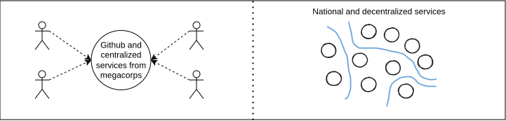

_Figure 18. Contrasting the current model of relying on centralized services from megacorporations with an alternative decentralized architecture based on national and regional hubs. Rather than promoting digital isolationism, these local platforms act as regional hubs that provide digital independence and self-reliance while maintaining global interoperability._

Software security must adopt the discipline of hardware engineering, building tangible and long-lasting systems without excessive external dependencies. However, when downloading an app like Kaspi and other applications in Kazakhstan, users have no simple way to verify what is bundled inside. Following the principles of radical transparency, our companies should openly disclose what makes up their software in form of Software Bill of Materials (SBOM) instead of hiding behind marketing slogans, as in examples from Figure 19. We should ensure transparency in any local software products/projects (composition, sources, codebases, processes, costs, schedule, efficiency) during maintenance or initial creation. It will let consumers decide for themselves if an application/service is worth trusting and independent researchers to inspect software systems even without reverse engineering.

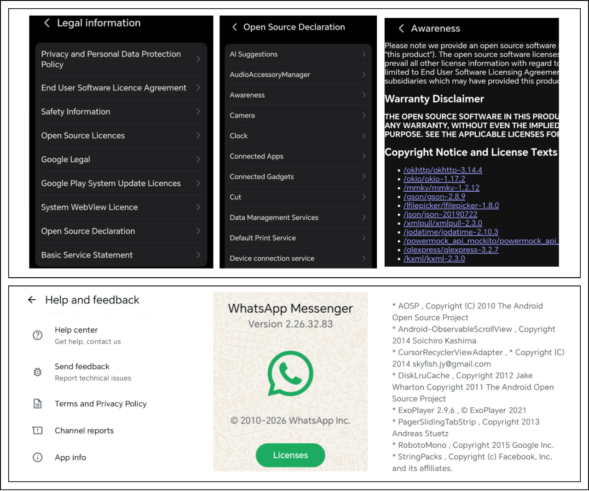

_Figure 19. Illustrating the practical disclosure of open-source components and licensing in modern mobile applications and system services. By providing detailed third-party software declarations and copyright notices, platforms offer basic visibility into their supply chain dependencies without compromising proprietary business logic._

## Conclusion

As I mentioned previously, software supply chain attacks will continue regardless of TeamPCP, as we are witnessing a mass emergence of copycats and modified Shai-Hulud variants like Mastra, Hades, and Miasma across open-source registries. I managed to obtain the Miasma worm source code before it started getting purged from every source and platform, which I will re-upload to the web archive a little later (additional references https://x.com/IntCyberDigest/status/2064277536960307611, https://github.com/YangYongAn/Miasma-Open-Source-Release, https://web.archive.org/web/20260607164751/https://github.com/kirkderp/Miasma-Azure-Durabletask, https://github.com/geliuz/miasma-azure-durabletask/, https://github.com/edxeth/Shai-Hulud-Open-Source). I plan to conduct its dedicated breakdown within an isolated malware laboratory setting and formal methodologies. To expand existing training materials, this research can serve as the foundation for an advanced educational course on dependency theory and defensive tooling, or even emulate real-world supply chain attack scenarios with virtual machines and network emulators to safely observe propagation patterns and test defense mechanisms. Additionally, I plan to research underground black-hat and gray-hat channels on Telegram, Discord, and forums, digging through their archives. Moreover, I still want to research AI model attestation and certification, as Kazakhstan currently lacks an established framework or formal process from both state-run platforms like synaq.sts.kz and private entities.

<!-- @TODO: move other links from text to parametrize them as references -->
[malwarepedia_about_teampcp]: https://malpedia.caad.fkie.fraunhofer.de/actor/teampcp
[aggregated_sources_about_teampcp]: https://ramimac.me/teampcp/
[cyber_kill_chain_definition]: https://en.wikipedia.org/wiki/Cyber_kill_chain
[swiss_cheese_model_definition]: https://en.wikipedia.org/wiki/Swiss_cheese_model
[tanstack_packages_compromise]: https://tanstack.com/blog/npm-supply-chain-compromise-postmortem
[trivy_security_toolkit_compromise]: https://www.aquasec.com/blog/trivy-supply-chain-attack-what-you-need-to-know/
[litellm_package_compromise]: https://docs.litellm.ai/blog/security-update-march-2026
[nx_console_vscode_extension_compromise]: https://nx.dev/blog/nx-console-v18-95-0-postmortem
[leak_of_internal_github_repositories]: https://github.blog/security/investigating-unauthorized-access-to-githubs-internal-repositories/
[teampcp_cooperates_with_shinyhunters]: https://research.checkpoint.com/2026/vect-ransomware-by-design-wiper-by-accident/
[breachforums_history]: https://en.wikipedia.org/wiki/BreachForums
[fbi_arrested_original_creator_of_breachforums]: https://www.justice.gov/archives/opa/pr/justice-department-announces-arrest-founder-one-world-s-largest-hacker-forums-and-disruption
[data_breach_of_canvas_lms]: https://en.wikipedia.org/wiki/2026_Canvas_data_breach
[shinyhunters_member_from_france]: https://www.justice.gov/usao-wdwa/pr/member-notorious-international-hacking-crew-sentenced-prison
[ttp_mitre_teampcp]: https://attack.mitre.org/groups/G1056/
[trust_wallet_shai_hulud_drained]: https://www.reflectiz.com/blog/trust-wallet-hack/
[ox_security_mini_shai_hulud_example]: https://www.ox.security/blog/shai-hulud-sap-supply-chain-attack-npm/
[statistics_about_ransomware_in_early_2026]: https://ransomnews.com/ransomware-office-hours-timing-2026/
[teampcp_post_about_data_breach_of_4000_internal_github_repositories]: https://www.linkedin.com/posts/blackheart-78626229a_looks-like-teampcp-is-claiming-access-to-share-7462597833766977536-B391
[report_about_vercel_data_breach_on_breachforums]: https://www.ox.security/blog/vercel-context-ai-supply-chain-attack-breachforums/
[apt_group_definition]: https://en.wikipedia.org/wiki/Advanced_persistent_threat
[lazarus_group_exfiltrated_billions_from_bybit]: https://www.fbi.gov/investigate/cyber/alerts/2025/north-korea-responsible-for-1-5-billion-bybit-hack
[microsoft_report_about_mini_shai_hulud]: https://x.com/MsftSecIntel/status/2054041471280423424
[google_wiz_report_about_mini_shai_hulud]: https://www.wiz.io/blog/mini-shai-hulud-strikes-again-tanstack-more-npm-packages-compromised
[china_about_teampcp_russian]: https://www.antiy.net/p/why-teampcps-russian-roulette-module-is-a-false-flag/
[teampcp_instasamka_russian_music_hint]: https://ramimac.me/teampcp/#playlist
[canisterworm_iran_specific_logic]: https://unit42.paloaltonetworks.com/teampcp-supply-chain-attacks/
[internals_of_wild_russian_blackhat_hacker_forums]: https://youtu.be/uh79nIR6xx8
[cybernews_investigation_about_russian_hacking_group]: https://www.youtube.com/watch?v=iogAWecLa-E
[chalk_npm_phishing_of_maintainer_account]: https://semgrep.dev/blog/2025/chalk-debug-and-color-on-npm-compromised-in-new-supply-chain-attack/
[megalodon_attacks_on_github_ci_cd_actions]: https://www.ox.security/blog/megalodon-cicd-malware-github/
[case_of_bypassing_slsa_provenance]: https://www.stepsecurity.io/blog/mini-shai-hulud-is-back-a-self-spreading-supply-chain-attack-hits-the-npm-ecosystem
[golang_dns_hijacking_backdooring]: https://socket.dev/blog/popular-go-decimal-library-typosquat-dns-backdoor
[archlinux_1]: https://www.phoronix.com/news/Arch-Linux-AUR-More-Than-1500
[archlinux_2]: https://www.phoronix.com/news/Arch-Linux-AUR-More-Malware 
[archlinux_3]: https://www.phoronix.com/news/Arch-Linux-AUR-Adoptions-Halted
[archlinux_4]: https://www.phoronix.com/news/Arch-Linux-AUR-400-Compromised
[linux_kernel_zero_days_discovered_by_frontier_models]: https://zerodayclock.com/
[motivations_of_black_hat_actors]: https://youtu.be/TLPHmHPaCiQ
[microsoft_refused_to_pay_security_researcher]: https://techcrunch.com/2026/05/29/microsoft-under-fire-for-threatening-security-researcher-with-criminal-investigation/
[tumar_one_first_bounty_linkedin]: https://lnkd.in/p/dNJHjPqX
[concept_pyramid_of_pain]: https://web.archive.org/web/20260716153321/http://detect-respond.blogspot.com/2013/03/the-pyramid-of-pain.html
[ttp_and_threat_hunting_techniques]: https://www.mitre.org/sites/default/files/2021-11/prs-19-3892-ttp-based-hunting.pdf
[us_allowed_offensive_operations]: https://www.whitehouse.gov/fact-sheets/2026/08/fact-sheet-president-donald-j-trump-expands-capabilities-to-combat-transnational-cyber-enabled-crime/
[my_dissertation_and_corresponding_research]: https://github.com/NoyanTM/aitu-masters-2026_dissertation-thesis
[perpetual_fallback_license]: https://sales.jetbrains.com/hc/en-gb/articles/207240845-What-is-a-perpetual-fallback-license-and-how-do-I-use-one
[open_core_model]: https://en.wikipedia.org/wiki/Open-core_model
[glassworm_on_solana]: https://attack.mitre.org/software/S9010/
[ethers_rat]: https://malpedia.caad.fkie.fraunhofer.de/details/js.ether_rat
[chaindrop_github_commits]: https://unit42.paloaltonetworks.com/chaindrop-npm-worm-analysis/
[c2_communications_social_networks]: https://www.pentestpartners.com/security-blog/discord-as-a-c2-and-the-cached-evidence-left-behind/
[c2_on_semi_legitimate_traffic]: https://safedep.io/microsoftsystem64-binary-payload-analysis/
[historical_events_of_supply_chain_attacks]: https://contribute.cncf.io/community/tags/security-and-compliance/publications/catalog/
