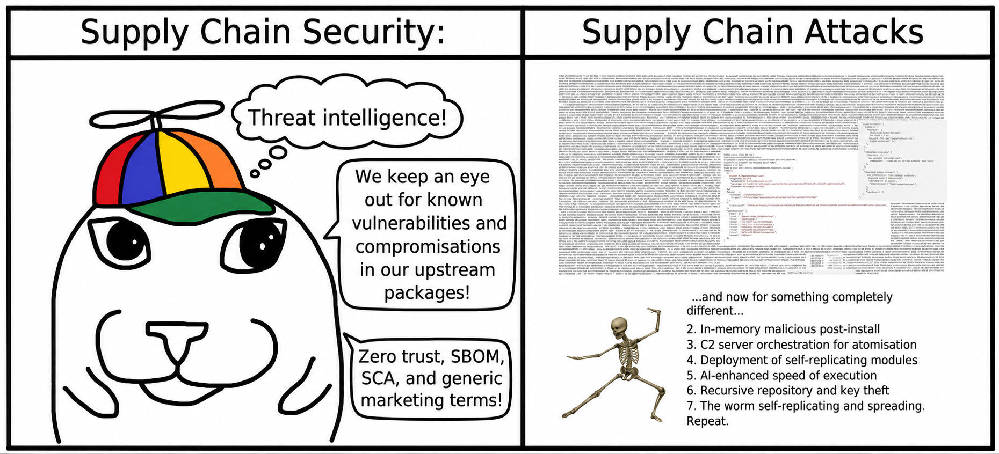
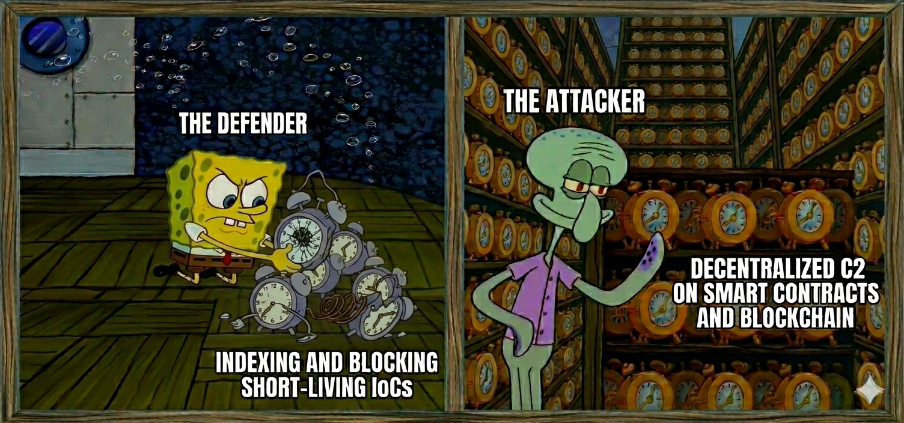

# Is TeamPCP a Russian-affiliated APT? How can preventive security principles assist defending ecosystems against attacks on software supply chains?

Metadata and reposts:
- [Substack](https://noyantm.substack.com/p/is-teampcp-a-russian-affiliated-apt)
- [Reddit](https://www.reddit.com/r/cybersecurity/comments/1ttyfik/is_teampcp_a_russianaffiliated_apt_how_can/)

_DISCLAIMER: I am a master's degree student in "secure software engineering" at Astana IT University in Kazakhstan, so this blog post only represents my personal mediocre perspective and reflections on the topic, rather than the position of a proficient industry expert. I welcome your feedback and further discussions. I used LLMs only for partial translation from Russian to English and for editing grammatical mistakes in this text._

## Introduction

Recently, the general public has started to more deeply understand software supply chain issues due to the rise in widespread incidents and compromises orchestrated by multiple threat actor groups, organizations, and activists around the world. In particular, it is worth to highlight the group known by the pseudonym "TeamPCP" and other aliases, which is disrupting the entire open-source ecosystem, repositories, distributions, and software companies. Their initial public activity started in 2025 with exploitation of react2shell and cloud-hosted instances, later culminating in software supply chain attacks, which continue to be their primary focus. I am not going to list every detail, link, or timeline of events related to TeamPCP. There are plenty of security firms and organizations that have already published comprehensive reviews, writeups, and incident reports. Also, you can also use LLMs and AI tools to aggregate such well-documented information and ask details about their methodologies, historical implications or events, attack vectors and surfaces. According to [aggregated sources](https://ramimac.me/teampcp/), their key campaigns are highly intertwined, creating a chain reaction where one compromise leads directly into the next one, illustrating [the Cyber Kill Chain](https://en.wikipedia.org/wiki/Cyber_kill_chain) of attacks and [the Swiss Cheese model](https://en.wikipedia.org/wiki/Swiss_cheese_model) of failures:
1. The series of Shai-Hulud attacks (i.e., "1.0", "2.0", "mini") on ecosystems as a self-replicating/propagating worm to build a C2 (Command and Control) infrastructure/botnet while also harvesting credentials, crypto wallets, environment tokens, access keys, raw data, and other secrets from infected systems to execute downstream operations.
2. Notable compromises across package repositories (e.g., NPM, PyPI, Cargo) such as [TanStack packages](https://tanstack.com/blog/npm-supply-chain-compromise-postmortem), [Trivy security toolkit](https://www.aquasec.com/blog/trivy-supply-chain-attack-what-you-need-to-know/), [LiteLLM package](https://docs.litellm.ai/blog/security-update-march-2026), and [Nx Console VSCode extension](https://nx.dev/blog/nx-console-v18-95-0-postmortem).
3. Their "magnum opus" of [the leak of internal GitHub repositories](https://github.blog/security/investigating-unauthorized-access-to-githubs-internal-repositories/). It is unknown what they are planning and preparing for their next attack targets, considering that they have already gathered significant experience and infrastructure assets from these operations. Moreover, there could be undetected sleeper agents and unknown ticking bombs that TeamPCP has injected across ecosystems, so Figure 1 exactly jokes about such limitations and flaws of the cybersecurity perspective.

<figure>
  
  <figcaption><i>Figure 1. Meme about the state of supply chain security vs. supply chain attacks.</i></figcaption>
</figure>

## Relationships between TeamPCP and other actors

There are numerous theories regarding who TeamPCP might be collaborating with or working for, including speculation that they are US insiders conducting operations to enhance the global cybersecurity posture by exposing critical flaws. However, let us look at the concrete facts that we currently have rather than conspiracy theories.

Firstly, [TeamPCP cooperates with the ShinyHunters](https://research.checkpoint.com/2026/vect-ransomware-by-design-wiper-by-accident/) threat actor group, who revived [BreachForums](https://en.wikipedia.org/wiki/BreachForums) after [the FBI arrested the original forum creator in 2023](https://www.justice.gov/archives/opa/pr/justice-department-announces-arrest-founder-one-world-s-largest-hacker-forums-and-disruption). Especially, ShinyHunters is known for conducting ransomware operations to profit from various companies and platforms (e.g., their [recent data breach of the Canvas LMS](https://en.wikipedia.org/wiki/2026_Canvas_data_breach)), as well as providing ransomware-as-a-service and malware-as-a-service to other black-hat actors. Previously, criminal reports indicated that several of their initial members were from Europe, but they operate in a decentralized way, acting more as a cybercriminal brand.

Secondly, TeamPCP is not only financially motivated, because [they rarely engage in standard ransomware operations](https://ransomnews.com/ransomware-office-hours-timing-2026/) and appear to be driven by various intents. Regarding their previous attacks, they harvested credentials to resell them, drain funds from compromised accounts, and leverage them for subsequent attacks without issuing any demands to victims, actively searching and developing new attack vectors/techniques to maximize chaos and disruption in software ecosystems. For example, they requested only 50 thousand dollars for a single buyout of [a data breach involving around 4 thousand internal GitHub repositories](https://www.linkedin.com/posts/blackheart-78626229a_looks-like-teampcp-is-claiming-access-to-share-7462597833766977536-B391) and declared that it was not an act of ransomware. Even if we assume they sell it in bulk to multiple buyers, this amount remains insignificant in comparison to [the Vercel internal data breach with a price tag of 2 million dollars on BreachForums](https://www.ox.security/blog/vercel-context-ai-supply-chain-attack-breachforums/), because sources exposure of GitHub is a more critical threat to the entire open-source ecosystem and related companies that depend on the platform (e.g., storing private repositories and environment secrets, or executing CI/CD actions, and so on). So, I think TeamPCP's actions are kinda similar to APT (Advanced Persistent Threat) groups like North Korea's Lazarus Group, which operate without negotiation and carry out operations to completion under a political agenda (e.g., [exfiltrating 1.5 billion dollars from Bybit](https://www.fbi.gov/investigate/cyber/alerts/2025/north-korea-responsible-for-1-5-billion-bybit-hack)).

Thirdly, [Microsoft Threat Intelligence](https://x.com/MsftSecIntel/status/2054041471280423424) and [Google Wiz](https://www.wiz.io/blog/mini-shai-hulud-strikes-again-tanstack-more-npm-packages-compromised) reported that the Mini Shai-Hulud from TeamPCP had a payload in a compromised Mistral AI package on PyPI with a dead man's switch that activates if the GitHub token is revoked. It also has country and location aware logic that ignores systems with a RU locale, and executes "rm -rf /" command with a 1/6 chance for systems from Israel or Iran. This indicates a fundamental connection with Russia, not a simple distraction for researchers or a coincidence. I guess that they are not like a formal APT operating directly as Russian government state actors, but instead function as contractors on a temporary basis or collaborate with recruited/independent Russian threat groups. For instance, Tor Zireael demonstrated in his video [the internals of wild black-hat hackers from Russia](https://youtu.be/uh79nIR6xx8) (including the Russian-speaking and Slavic space), who adhere to rules of "we don't abandon our own, and we don't attack on our own", meaning that any hacking operations are discouraged against the CIS (Commonwealth of Independent States) sphere of influence and its domestic infrastructure. Of course, it is not a noble morality or ethics, because otherwise they would be arrested or eliminated, so the state permits them to operate only against external targets whom they refer as "the Collective West". Some of them may receive direct state sponsorship or structural preferences from government-military contracts by execution of specific tasks (e.g., cyber operations against Ukrainian targets). This represents their systemic approach for causing harm and disruption across various sectors, considering the following cases:
- [The Killnet hacking group](https://en.wikipedia.org/wiki/Killnet), which operated under FSB direction;
- [Ilya Remeslo](https://ru.wikipedia.org/wiki/%D0%A0%D0%B5%D0%BC%D0%B5%D1%81%D0%BB%D0%BE,_%D0%98%D0%BB%D1%8C%D1%8F_%D0%91%D0%BE%D1%80%D0%B8%D1%81%D0%BE%D0%B2%D0%B8%D1%87) and Telegram-based trolls, posting biased pro-Russian news;
- [Kremlinbots](https://en.wikipedia.org/wiki/Russian_web_brigades) across the entire internet, spreading state propaganda.

Particularly, this is a deeply concerning issue for me, given that our government cooperates with and trusts the Russian Federation in the construction of a nuclear power plant and other critical infrastructure in Kazakhstan, which could come with potential backdoors. From my point of view, Russia is an unreliable partner that only prioritizes its own well-being and is willing to betray anyone for its own benefit and reckless ambitions, such as starting a war (same thing about US). Interestingly, based on my experience working within the FMA (the Financial Monitoring Agency of Kazakhstan) and alongside other government entities with their intelligence agents, who are predominantly relatively young men aged 20 to 40, they actively cooperate with Belarus and the Russian Federation like according to Soviet-era playbooks. This trend persists despite the fact that our general population does not support the Russo-Ukrainian war and has a large ethnic Ukrainian diaspora stemming from the Soviet era, as well as new arrivals who have come since 2022. Moreover, Kazakhstani cybersecurity entities (e.g., the State Technical Service, TSARKA, and others) don't publicly mention about or review recent global incidents of software supply chain attack, which indicates hidden internal dynamics, misplaced priorities, or basic ignorance.

# The industry issues exposed by TeamPCP and recent software supply chain attacks

Such incidents and historical events have revealed various insights for self-reflection within the global software engineering community.

Firstly, these indirect attacks must be taken into consideration as seriously as direct pentesting techniques due to scaling and spreading factors of supply chain threats. Also, we should raise general situational awareness through trusted blogs and news, from which we can gather information to stay up to date on such security incidents (e.g., [Google Wiz](https://www.wiz.io/newsroom), [SafeDep](https://safedep.io/blog/), [Snyk](https://snyk.io/blog/), [Ox Security](https://www.ox.security/blog/), etc.).

Secondly, this problem of supply chains and logistics extends beyond the digital space into the physical one, from which we can get valuable insights and map them onto the IT sphere. Even if users actively adopt baseline defense measures on endpoints, it is a temporary or partial workaround. For example, only using filters on a faucet cannot save you for a long period from poisoned water in a well, so instead you should have a defense-in-depth approach across all elements (i.e., wells, pipes, and filters). So, Figure 2 highlights three main components of the software supply chain as vulnerable points of failure for potential attacks.

<figure>
  
  <figcaption><i>Figure 2. The lifecycle and attack surface of the software supply chain: (1) Sources, as primary and secondary repositories (e.g., packages, source code, containers), which are vulnerable to account theft, signature spoofing, platform compromises, phishing, and typosquatting. (2) Transportation, as delivery pipelines and related infrastructure (e.g., <a href="https://www.ox.security/blog/megalodon-cicd-malware-github/" target="_blank">the Megalodon attacks on GitHub CI/CD actions</a>, <a href="https://www.stepsecurity.io/blog/mini-shai-hulud-is-back-a-self-spreading-supply-chain-attack-hits-the-npm-ecosystem" target="_blank">bypassing SLSA provenance</a>, <a href="https://socket.dev/blog/popular-go-decimal-library-typosquat-dns-backdoor" target="_blank">DNS hijacking/backdoor</a>, etc.). (3) Endpoints, involving users or systems that utilize the received artifacts, package management systems, and tooling (e.g., post-install scripts with malware).</i></figcaption>
</figure>

Thirdly, [AI-assisted attackers have a high execution speed](https://www.ox.security/blog/ai-attacks-are-outpacing-static-security-tools/) when it comes to realizing and implementing their operations, learning from mistakes, pivoting, and iterating. This was recently demonstrated by the multitude of [Linux kernel zero-day vulnerabilities discovered by LLMs](https://zerodayclock.com/). On the other hand, as users rush to adopt AI agentic systems, they tend to operate in [YOLO or autonomous modes](https://code.claude.com/docs/en/permission-modes) without reviewing the produced output, leaving themselves vulnerable to AI-targeted attacks (e.g., prompt injections, compromised models, and control takeovers).

Fourthly, we shouldn't blame specific individuals and actors (both attackers and defenders), because these are systemic failures that have to be acknowledged and solved iteratively, as new threat actors and communities start to practice methodologies and playbooks from TeamPCP. Software security and reliability should match the strict standards and mindset of hardware engineering. For instance, treating software as something tangible and long-term, designed to solve a specific problem without too many unnecessary external dependencies.

Fifthly, I don't want to judge TeamPCP and other threat actors, neither do I try to portray them as "bad guys", because this is a social issue, not just a technological one. [Many black-hat actors have different motivation](https://youtu.be/TLPHmHPaCiQ): being resentful of the current system (political and economical), want to prove their points, or are simply financially pragmatic people. A recent case involving Microsoft clearly show this, in which [they refused to pay a researcher and began blocking him](https://techcrunch.com/2026/05/29/microsoft-under-fire-for-threatening-security-researcher-with-criminal-investigation/), literally turning a white-hat into a black or gray one. This is due to the fact that the bug bounty triage and payout process depends on the specific organization and platform (such as HackerOne, Bugcrowd, Google VRP, or MSRC), which dictate their own rules regarding acceptable vulnerability types and attack vectors. Last year, I even began planning out (only conceptually, not a real attack) how one could launch an attack on GitHub dependencies and its technological stack (e.g., compromising Ruby on Rails) to fight back against rising CI/CD prices, DMCA and copyright repository takedowns, and availability issues stemming from buggy “microslop” releases like the situation of Windows 11. Overall, the cybersecurity and software communities are on the edge due to the pressure of wage stagnation and the devaluation of human dignity.

## Next steps to improve the current situation of software supply chain security

As mentioned previously, these types of attacks are inevitable, requiring us to revise our approaches. For example, [my dissertation and corresponding research](https://github.com/NoyanTM/aitu-masters-2026_dissertation-thesis) propose a preventive security methodology designed for the source side. It acts as a quality gate for repositories, restricting or delaying the propagation velocity of compromised packages across both time and space to minimize overall harm to the ecosystem.

Basic protection principles from the perspective of endpoints include:
- pinning specific package versions rather than the latest releases;
- verifying artifact hashsums and validating cryptographic signatures;
- adhering to stable versions with security backports, except mitigating critical CVEs;
- disabling automatic updates and post-installation scripts;
- conducting preliminary analysis and indexing of the dependency tree;
- restricting package versions that were published less than 30 days ago;
- implementing vendoring to reuse locally pre-installed packages;
- hosting and curating private package repository;
- minimizing number of dependencies by using the standard library or lightweight libraries over frameworks and writing only task-specific code.

Moreover, there will be a movement in the industry toward decentralization and alternative forms of source code hosting, against using centralized commercial platforms like GitHub:
- Nation-state repositories tied to government agencies should be funded directly by the public. This ensures the active involvement of citizens in the process, similar to how taxes fund municipal services. As a result, people will become more responsible and aware that software is an integral part of their lives, rather than just a free service that shouldn't be paid for.
- Public and independent organizations like Codeberg in Germany rely on donations or contributions on a voluntary basis, changing the perspective on software from consumeristic to collaborative while ensuring sustainability and maintenance of projects. Also, it can combined with subscription models based on a [Perpetual Fallback License](https://sales.jetbrains.com/hc/en-gb/articles/207240845-What-is-a-perpetual-fallback-license-and-how-do-I-use-one) and the [Open-Core model](https://en.wikipedia.org/wiki/Open-core_model), which do not restrict access to versions already owned at the time of purchase.

## Conclusion

It is impossible to simply wait things out without addressing the problems at their core, because such software supply chain issues affect other ecosystems as well:
- Gaming and modding communities where users are not technically proficient (e.g., Minecraft, ModDB, Roblox, Gmod, Sbox).
- Utility and supplementary software (e.g., NixOS packages, CTAN/TeX libraries, ArchLinux packages, Debian packages) along with more niche software repositories (such as Maven, NuGet, and others) beyond the mainstream.
- [AI-related supply chains](https://open.substack.com/pub/disesdi/p/attacking-and-threat-modeling-the-603) (e.g., Hugging Face, Kaggle, API wrappers like LiteLLM, and harness software packages such as the Axios supply chain attack that affected Claude Code).
- Current closed-source software solutions that heavily rely on critical open-source infrastructure (e.g., GDB, GCC, LLVM, CPython, rustc).

In my upcoming posts, I will attempt to do such things for educational purposes:
- Explore hidden black-hat / gray-hat communities in Telegram, Discord, and dedicated forums (e.g., Lolzteam, BreachForums, and so on).
- Create an educational course on dependency theory at a meta-level specifically for cybersecurity professionals, with a focus on developing security tools and conducting supply chain attacks as practical training exercises (like https://challenges.re/ and https://github.com/guyinatuxedo/nightmare).
- Recreating supply chain attacks within an isolated environment to study existing techniques and playbooks from past incidents in detail. This also involves practicing methods of AI-assisted hacking, bypassing threat intelligence, jumping between multiple VPS nodes to hide traces (similar to crypto tumbler operations), and hosting C2 infrastructure on blockchain smart contracts to prevent blocking by predefined short-lived IoCs (Indicator of compromise) like in Figure 3.

<figure>
  
  <figcaption><i>Figure 3. Meme about decentralized C2 infrastructure (e.g., <a href="https://attack.mitre.org/software/S9010/" target="_blank">GlassWorm on Solana</a>).</i></figcaption>
</figure>
