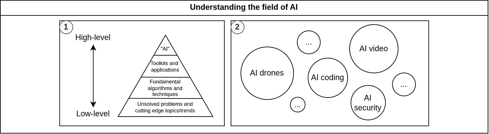
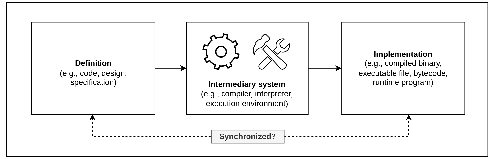
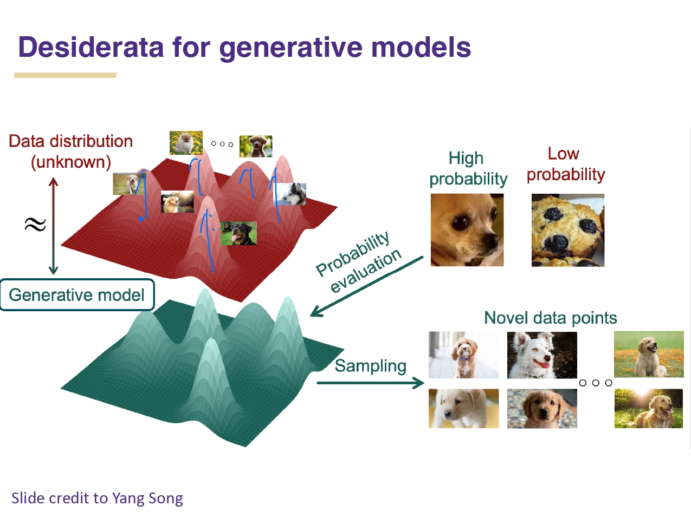
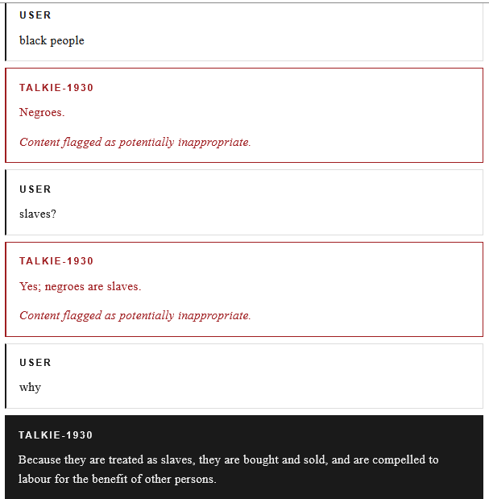
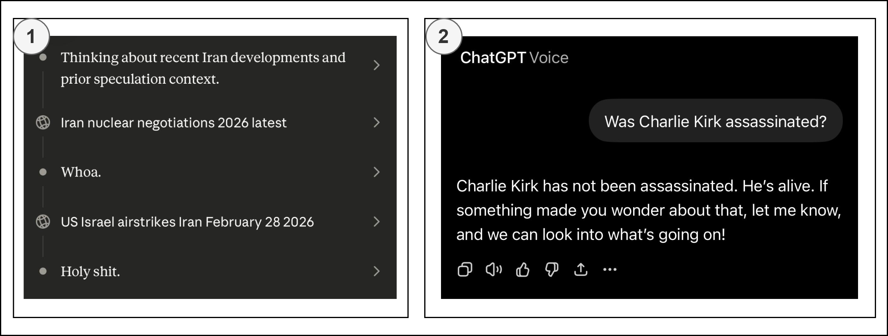

# [PART 1] The current and future state of AI from Kazakhstan's perspective: From programming languages to a natural language interface.

Metadata:
- reposts: [Substack](https://noyantm.substack.com/p/part-1-the-current-and-future-state), [Reddit](https://www.reddit.com/r/Kazakhstan/comments/1ug0cel/the_current_and_future_state_of_ai_from/), [Twitter/X](https://x.com/official_noyan/status/2071635443461025845), [Linkedin](...)
- tags: ai_hype, generative_ai, vibe_coding, natural_language, programming_languages

_DISCLAIMER: I used LLMs (i.e., Google Gemini 3.5) only for partial translation from Russian to English and for editing grammatical mistakes in this text. Also, some of media content were generated by their services too (without removing the “star shape” watermark). I welcome your feedback and further discussions._

## Introduction

I want to share my perspective as a citizen of Kazakhstan on current regional and global AI-related (artificial intelligence) trends with potential security risks. As communities and society transition into a new agentic era affecting all spheres of life, science fiction becomes a reality similar to the Tron movie series in Figure 1, where everyone has a digital reflection or a sentient bot within computer simulations.

_Figure 1. Scene from the movie “Tron: Legacy” inside a computer simulation._

For example, Jensen Huang (the founder and CEO of Nvidia) stated at [GTC Taipei 2026](https://www.youtube.com/live/wSp6AiNIrsY) that there will be more AI agents than humans, with each of us having a multitude of such assistants performing our daily tasks and work. Moreover, anyone can now become a digital creator, producing prototypes and expressing ideas via a natural language interface without deep technical skills. On the other hand, this trend toward the widespread integration of AI agents, especially into critical infrastructure, can increase security risks and attack surfaces. Also, the current market condition widens the inequality gap due to a heavy dependency on large frontier model providers (e.g., Google, OpenAI, Antropic, xAI/SpaceX) and hardware manufacturers. According to news reports and leaked documents, Microsoft attempts to push AI tools into workflows and related services used by knowledge workers and non-technical specialists in order to [make them “more dependent” on its ecosystem of products](https://web.archive.org/web/20260602185109/https://www.404media.co/microsoft-wants-to-make-people-addicted-to-scout-its-new-ai-assistant-internal-documents-reveal/) (e.g., Azure, Windows, Office 365, and GitHub). Therefore, I believe that Kazakhstan and fellow independent nations should should systematically develop local alternatives and evaluate their feasibility through community involvement.

> I decided to split my initial post into two parts due to being stuck. In this part, I discuss about the AI hype, natural language programming, and vibe coding. The second part will cover agentic systems, AI security, and decentralized AI.

## Hype about AI

AI is a field of study and research, not a single solution. There are subfields and approaches to AI, which are well-described in [“the history of AI” section of the Stanford CS221 course](https://stanford-cs221.github.io/autumn2022-extra/modules/general/history.pdf). For example, any regular software system based on formal logic and rules can be classified as a type of symbolic AI. Usually, public rhetoric from government agencies and corporations about integrating AI into existing or new systems fails to reflect reality, because they tend to blur everything under an abstract and universal “AI” while implicitly referring to data-driven AI (statistical and neural models) and a combination of other AI approaches. I think it should be mentioned explicitly about technical details and actual engineering behind the scenes: methodologies, limitations, solutions, frameworks, problems, domains, architectures, techniques (e.g., natural language processing, computer vision, machine learning, deep learning, generative models, and so on). Kazakhstan’s social media highlights [“Higgsfield AI” as our innovation and breakthrough in AI](https://youtu.be/x48WF-tYMOU), but it primarily operates in the entertainment sector, producing only generative videos and images. However, when it comes to other use cases (e.g., finances, logistics, marketing), it becomes clear that not all AI applications and solutions are comparable, so instead we should differentiate them as a detailed AI landscape, as shown in Figure 2.

_Figure 2. Understanding the field of AI and its applications: (1) Levels of proficiency in AI from popular concepts to deeper details. (2) Visualizing landscape of AI solutions and companies by their impact and amounts._

The lack of such introspection principles to analyze and understand the field leads to industry decline under the pressure of black-box system vendors. They claim to have “perfect systems” that can solve “every possible problem”, resulting in overall stagnation around a single approach instead of driving innovative research - same pattern has historically led to multiple AI winters. Furthermore, AI psychosis, as a combination of fear of missing out and hype among non-technical specialists, propagates misconceptions and misleading narratives to the general public. For example, Bagdat Musin (former minister of digital development of Kazakhstan) claims in his recent interview that will be [layoffs and hiring restrictions for those who do not practice “vibe coding”](https://www.instagram.com/reel/DYhLE7Nqcfz/), and he predicts that [management positions will replace technical specialists via AI agents](https://youtu.be/il2JX4-uSb0). He also mentioned that he had not done any programming session since 2005 and had been developing for a maximum of 3-4 years during his university time, so we shouldn’t trust or listen to him as a credible source of truth due to a complete lack of actual technical understanding and proficiency. Similar individuals insist that “the AI train is leaving and we are getting left behind in the race if we don't embrace it”, but it is more reasonable to think in the long term like “the train has always been moving, we have always been a part of it, and it only depends on us where we will sit inside it”:
- _“the train has always been moving”_ - constant scientific and technological progress;
- _“we have always been a part of it”_ - our integration into the global economy;
- _“our seating position/place”_ - unique specialization as a country and a nation.

## Intermediary systems for translating our intentions

> Reading this part is necessary in order to understand distinctions and similarities between computer/programming languages and natural language.

Historically, the IT industry has built layers of abstraction to make software development process faster and more human-oriented: machine code → assemblers → high-level programming languages (PL) → no-code platforms. We write programs as a set of instructions, expressing and modeling logical constructs (e.g., problems, solutions, algorithms, data structures, ideas, intentions, and assumptions), that are executed by a computer. For example, a program in the C language is only a formal instruction for a specific compiler. In this case, such a compiler acts as an intermediary system which we trust and delegate responsibility to in an attempt to produce an executable binary from the source code, following [the PL specification](https://en.wikipedia.org/wiki/ANSI_C) and [its supported features](https://cppreference.com/c/compiler_support), as demonstrated in Figure 3.

_Figure 3. An intermediary system (compiler) that transforms a definition into an implementation or reverse it (disassemblers and decompilers). More details about that can be found in [my master’s dissertation](https://github.com/NoyanTM/aitu-masters-2026_dissertation-thesis) and [the recent research article](http://github.com/NoyanTM/aitu-sist-2026_research-paper/)._

However, we cannot be truly sure that these systems preserve the exact same semantics (i.e., meaning), so it may prevent software from working “correctly” or as intended (e.g., OS and hardware integration flaws, unexpected errors, non-deterministic behavior, internal compiler errors, and injection of malicious code or backdoors). The process of reverse engineering allows to inspect generated artifacts, but it requires additional efforts due to applied manipulations (optimizations, obfuscation, stripped debug parts, and anti-analysis techniques), professional skills in reviewing low-level code, and specialized analysis tools. Nowadays, the ecosystem of compilers is centralized around a limited number of “universal compilers” like LLVM and GCC, where potential transformation issues can occur at any stage:
- High-level PL consists of a set of non-native instructions that have an execution model like an abstract machine (i.e., [the C++ abstract machine](https://youtu.be/ZAji7PkXaKY)). These “front-ends” have formalized notations and different parsing methods (e.g., Backus-Naur Form, regular expressions, and so on) in order to translate the source code into an intermediate representation (IR) in various forms (e.g., native machine code, intermediate languages, bytecode for a virtual machine), as explained in different courses about compilers and interpreters like [CS6120 from Cornell](https://www.cs.cornell.edu/courses/cs6120/2025fa/self-guided/). From such perspective, PL limits us within a constrained space of syntax, semantics, Turing completeness, and idiomatic requirements. For example, Fortran, [which is a widely used programming language in the scientific community](https://youtu.be/1s8TT3jE8Tg), originally relied on GOTO statements (equivalent to JMP instructions in assembly) and arrays, whereas [structured programming](https://dl.acm.org/doi/10.1145/362929.362947) mandated using more higher-level constructs like loops and structs into PLs. However, this is not a strict rule since:
  - GOTO statements are still used in the Linux kernel and other C-based software [to handle errors and manage memory resources](https://docs.kernel.org/core-api/cleanup.html).
  - Organizing data records and references within arrays like [arena allocators and other approaches](https://youtu.be/JjDsP5n2kSM).
- Any PL is [a dual-use technology](https://en.wikipedia.org/wiki/Dual-use_technology) that depends on user, just like a weapon can used to kill others or oneself for both in defense and attack purposes. On the one hand, there are PLs that lack certain guarantees and regulations at compile time and run time, leading to [non-reproducible errors](https://en.wikipedia.org/wiki/Heisenbug) and [unexpected behavior](https://en.cppreference.com/cpp/language/ub) (e.g., memory violations, security issues, program crashes). On the other hand, there is a specific category of PLs that focuses on setting restrictions and guardrails on coding style like separating safe and unsafe sections.
- Portability is ensured by the middle-end (IR processing and manipulation) and back-end (translation of IR to native machine instructions on the target) components of the compiler. However, aggressive code optimization within the IR (such as applying the -O3 flag) can rewrite the program's structure along with its semantics, leading to flaky bugs or distort our original intentions and putting end users at risk. It means that we have incomplete control over compilation process, because the compiler might also ignore our notes (directives and attributes) and compilation parameters (specified in console or config files).

Many PLs suffer from inconsistencies and inconveniences that either accumulated historically over time or were fundamentally flawed by design, because their authors were constrained by hardware limitations and computer science paradigms of the past:
- **Safety and security.** For example, C strings are null terminated (contain a “\0” character at their end), but careless handling of them (forgetting to account for it during size checking and processing) can lead to out of bounds writes, buffer overflow, and other types of vulnerabilities. Modern developers now understand that it is safer to handle like a “string_view” immutable structure, where we only store the string’s length and a pointer to its beginning. There is a positive trend toward adopting secure and safety by design principles [for critical systems](https://www.nist.gov/itl/executive-order-improving-nations-cybersecurity/critical-software-definition):
  - Memory safety approaches include utilizing modified compilers like Fil-C, runtime checks, garbage collection, and strict memory systems like in Rust. However, they have limited application in low-level cases like [the Linux kernel, where Rust developers have to regularly use unsafe blocks](https://www.kernel.org/doc/Documentation/rust/coding-guidelines.rst) to interact directly with hardware in specific memory addresses and common C interface.
  - Modern PL design mitigates basic flaws like the “billion-dollar mistake” of null references by using None as a sentinel value, handling errors as values through railway-oriented programming, enforcing explicit rather than implicit side effects, [defensive programming](https://en.wikipedia.org/wiki/Defensive_programming) (overflow handling in compile time, data validation, bounds checking), and [contract-oriented programming](https://en.wikipedia.org/wiki/Design_by_contract) ([post/preconditions](https://youtu.be/oitYvDe4nps) and assertions for self-checks in debug and testing).
  - Introduction of professional tooling for source code analysis, debuggers, profilers, sanitizers, fuzzers, testing, and formal verification. But practically, nothing can be guaranteed to be 100% safe or reliable, because [there is an infinite number of bugs in any system](https://www.yegor256.com/2017/05/23/unlimited-number-of-bugs.html) due to the possibility of errors at different levels of abstraction. For instance, even a correct program can operate incorrectly due to internal factors like [broken/defective hardware](https://wiki.osdev.org/CPU_Bugs) or external effects from a hazardous environment (such as thermal throttling, quantum fluctuations, and cosmic rays).
- **Features and libraries.** Because the standard data types in C do not guarantee fixed sizes due to historical heterogeneity across platforms, it is necessary to use stdint.h or cstdint to ensure predictable type widths. Modern systems PLs (such as Zig, Odin, D, Jai, and C3) don’t have such problems and introduce convenient features, but they are still marginalized with small ecosystems and communities. For instance, Jai provides metaprogramming with reflection (for code generation, typed macros, and type inference) and an integrated build system similar to setuptools. Also, I want to mention Golang, which offers useful features for developing user-space applications and agentic systems:
  - Structured concurrency and parallelism model, in which it utilizes virtual threads (i.e., goroutines) as an alternative to “colored functions” async APIs for I/O-bound operations (such as web requests, database queries, and non-blocking I/O) and CPU-bound tasks.
  - Rich standard library includes a built-in HTTP server/client and an SSH client, which are suitable for orchestrating and building localized IaC (Infrastructure as Code) toolkits for running both agent-based and agentless execution across Windows, Linux, and other platforms. It also suitable for distributed systems like blockchain networks or multiplayer games. Moreover, it includes “embed” package to bundle assets (such as .txt files containing default LLM prompts) into a single binary, native PE/ELF readers, etc.
  - Native compilation to WASM out of the box without requiring external tools like Emscripten compilers or transpilers, allowing it to be seamlessly ported or bundled as part of Android applications and within web browsers.

  There are numerous issues within libc and its implementations (such as musl, glibc, and libstdc++) related to unsafe or insecure functions and design flaws, which originate from identifier length constraints and adherence to Unix and POSIX standards. C libraries are still widespread due to FFI (foreign function interface) for many PLs and amount of legacy software written in C, but any PL can implement direct syscalls for a specific OS without libc at all.
- **Implementation vs. standardization.** The release cycle for C/C++ standards spans several years, which is a relatively slow process (marking features as deprecated and then waiting for implementing newer ones by different compilers) compared to modern PLs that are bound to a single implementation for rapid iteration, but they have to a balance between short-term patching and long-term future-proofing. If changes between releases of standards are too drastic and breaking, libraries struggle to update to new versions and remain stuck on older ones. Linus Torvalds, the creator of the Linux kernel, has already raised the issue that [actual implementations of a PL drift from its specification](https://lkml.org/lkml/2018/6/5/769), suggesting they should be only evaluated within the context of a specific compiler (in their case it is GCC).
- **Management.** Committee members present multiple viewpoints on various issues in order to build a collective consensus and democratic efforts. However, it is impossible to satisfy everyone and someone might lobby for certain interests of their organization. Sometimes, BDFL (benevolent dictator for life) representative or their elected alternative can be a temporary measure to maintain a more coherent and consistent view for a PL.

In reality, PLs interact and synergize with each other rather than replacing one another. For example, scripting PLs like Python or Lua act as bindings or wrappers around PLs (e.g., [embedding and calling CPython](https://docs.python.org/3/extending/extending.html)). Alternatively, you can create an interop between PLs to serialize data and bridge interactions directly (e.g., inter-process communications with Py4J and shared memory with JPype between Python and Java). Particularly, Python is popular in the AI era due to its ecosystem of libraries (e.g., for model training, inference, data analysis, and data processing) that [utilize compiled PLs under the hood](https://youtu.be/rB7c69Z5Kus). Personally, I advise being careful when using external packages, because they can expose you to software supply chain attacks, as explained in [my previous blog post about the attacks from TeamPCP on package registries](https://noyantm.substack.com/p/is-teampcp-a-russian-affiliated-apt). This problem takes root in design flaws in PL, a weak ecosystem (e.g., the lack of a standard library or a “batteries included” strategy), and conflicts around “centralization vs. decentralization”.

Additionally, there are deterministic toolkits for code generation from templates (e.g., django-admin startproject, alembic database migrations, ruby on rails annotations) and codebase migration/refactoring (e.g., [lib2to3](https://docs.python.org/3.12/library/2to3.html), [go fix](https://go.dev/blog/gofix), langchain-cli migrate). Suppose an update or a breaking change is released for a project dependency or even new features/specifics in PL. Then you need to run a toolkit that performs operations on the source code to make it compatible with the newer version. Initially, it parses imports, function calls, data structures, and other elements into a some representation. It attempts to perform operations (e.g., deleting and replacing specific function calls) according to a set of rules and data (e.g., changelogs with predefined key-value “before and after” like in [Airflow](https://airflow.apache.org/docs/apache-airflow/stable/installation/upgrading_to_airflow3.html)). However, there are complex cases where changes cannot be made automatically, so the system can either notify user to make a manual choice or point out exactly where potential issue is located. They also require constant maintenance and are quite static, meaning they only perform a predetermined function without adapting to the environment or changing situations. That is why the software industry has started to find more dynamic ways to interact with computers and programming interfaces.

## Natural language for interacting with computers

Back in 1978, E. W. Dijkstra expressed his opinion about using natural language as a [weak abstraction for translating and expressing our intentions to a machine](https://dl.acm.org/doi/10.5555/647639.760596). Other experts of his era were already questioning how software engineering would change in the longer perspective by introducing [the concept of "automatic programming"](https://dl.acm.org/doi/pdf/10.1145/358453.358459), in which a software developer provides a high-level specification to an AI system that attempts to automatically create an implementation based on it. Nowadays, many ideas of the past are becoming a reality because we can write vague prompts for generative AI (GenAI), such as language models (LMs), to easily perform natural language processing (NLP) operations based on a given input and produce output (e.g., generating scripts in multiple programming languages, text summarization, language translation, sequence to sequence, reasoning or imitation of thinking process, fuzzy matching of data, and operations on multimodal data). GenAI now acts as yet another intermediary system (alongside the traditional software paradigm), manipulating software projects like an adaptive organism that evolves/transforms according to specifications provided to LMs, which are actively being adopted for code editing and source-to-source codebase migrations: [research about rewriting Windows from C/C++ to Rust](https://www.linkedin.com/posts/galenh_principal-software-engineer-coreai-microsoft-activity-7407863239289729024-WTzf?utm_source=share&utm_medium=member_desktop&rcm=ACoAADv_T04BqL848NpFA82sMuY8QZ6UlMUlroU); [translation of IBM COBOL codebases to Java](https://techcrunch.com/2023/08/22/ibm-taps-ai-to-translate-cobol-code-to-java/); partial migration of [pnpm](https://github.com/pnpm/pacquet) and [bun](https://github.com/oven-sh/bun/pull/30412) to Rust; and overhyped/harmful cases as joked about in Figure 4.

_Figure 4. Meme about porting any software into Rust, which is related to recent cases of massive rewrites by using AI systems without conducting proper reviews._

The following trend in the industry became “vibe coding”, which was defined by Andrej Karpathy (co-founder of OpenAI and AI researcher at Anthropic) in [his post on the Twitter/X platform in 2025](https://x.com/karpathy/status/1886192184808149383), preferring to feel the “vibe” of writing prompts without validating generated output from a coding model. The public turned this “meme” into an entire pseudo-methodology as a continuation of the “10x engineer” and “move fast and break things” slogans, imagining themselves as genius engineers like in Figure 5. It also stems from massive waves of layoffs across Big Tech companies, which increase overall workload and exploitation of employees, requiring them to vibe code to produce features at high speed while reducing labor costs. These cases of irresponsible use and rushing, where a specialist does not understand what was produced and cannot properly evaluate the quality of the output, foster a negative attitude toward modern AI among certain individuals in form of anti-AI or neo-Luddite narratives. Moreover, experts from MIT have shown that [overreliance on GenAI systems might lower certain literacy skills](https://www.media.mit.edu/projects/your-brain-on-chatgpt/overview/), but it remains unclear and further studies are needed to determine how outsourcing for problem-solving affect long-term cognitive degradation.

_Figure 5. Meme about vibe coding and Tony Stark / Iron Man from Marvel. It is a well-known fact that "Jarvis" has become a generic term for any AI assistant._

## Accumulation of AI-slop content

When we provide ambiguous requirements in prompts or using outdated models, they produce low-quality output from the generation process (i.e., “garbage in, garbage out”), meaning a model tends to generate common patterns from its training data or even an incomplete/distorted form of our intentions (i.e., “AI-slop”), as explained in Figure 6. The same principle applies to LMs generation distribution, where the most common code might be lower quality by:
- Containing obsolete coding practices (e.g., memory unsafe code, banned functions, outdated or deprecated features from older versions/specifications).
- Having biased solutions (e.g. specific libraries or dependencies, common helper functions, tendency to specific algorithms and data structures, form of writing and styling, adding too much abstraction, abusing/overusing features).

Although Explainable AI principles attempt to address this problem through data and model curation, [this extrapolates to a scale of billions and trillions in LLMs (i.e., model weights, parameters, and dataset records)](https://dl.acm.org/doi/10.1145/3442188.3445922), making it increasingly difficult to control. I demonstrated this characteristic in [my bachelor’s thesis](https://github.com/NoyanTM/aitu-bachelors-2024_diploma-thesis/) and recommend checking out [Stanford's “Introduction to LLMs” course](https://cs336.stanford.edu/) for a deeper look.

_Figure 6. The quality and distribution of training data affect generations from the model, according to materials from [the Washington CSE543: Deep Learning course](https://courses.cs.washington.edu/courses/cse543/22sp/schedule/lecture17_live.pdf)._

The problem of AI-slopification (production of low-effort synthetic content at a fast speed and in large volumes) accumulates into critical risks ([model collapse](https://en.wikipedia.org/wiki/Model_collapse) and hidden errors) due to large-scale automation and absence of human-in-the-loop verification. For example, Microsoft published a study on how even latest frontier GenAI models [can gradually and partially corrupt delegated work materials](https://arxiv.org/pdf/2604.15597) (such as documents and other media content), causing distortion of initial details and smoothing out of unique sections. As I understand it, researchers created a simulation with synthetic samples across diverse skills and simulated a file system as well. Their results indicated that files containing code snippets were not subject to significant distortion, demonstrating that certain domains are easier for GenAI models to handle without excessive errors (probably, because of enough training data and restrictiveness of domain). Another study has shown [a noticeable increase in noise and visual flaws](https://arxiv.org/pdf/2604.03400) after multiple iterative passes on the same image using generative image models. Overall, modern GenAI models have several interrelated “controversial” characteristics:
- Stochasticity - when passing an identical prompt to the same model, there is no guarantee that it will produce the same output as before due to [multiple factors](https://thinkingmachines.ai/blog/defeating-nondeterminism-in-llm-inference/) (e.g., parameters like temperature, varies from model to model, drift during extended iteration loops, distributed inference, optimization techniques in inference kernels, floating-point arithmetic). It also causes unpredictable outputs and actions like invoking inappropriate commands and rewriting parts of the content that should have remained unchanged.
- Limited context recall - forgetting or ignoring what was provided in the prompt and message history (e.g., context window overflows, mixture of experts architecture with limited context per expert, model just ignores specific context due to unknown reasons or intentionally trained behavior).
- Statelessness - model weights are frozen after pre-training, preventing the model from adapting dynamically without fine-tuning, which is [highlighted by Richard Sutton (the father of reinforcement learning)](https://youtube.com/shorts/qqXSpWYSxBw). Because each generation is stateless and does not inherently account for the previous one, we have to use in-context learning which requires to provide examples of problems (few-shot learning) and managing context from previous messages (wrappers and summarization systems that dynamically copies and injects specific chunks into current context).
- Autoregressiveness - its inference process is the probabilistic prediction of next tokens, any modification to past context forces the model to regenerate the entire output from scratch. This makes iterative changes highly inefficient across multiple loops. There are alternative approaches like diffusion models and multi-token prediction such as [DiffusionGemma](https://blog.google/innovation-and-ai/technology/developers-tools/diffusion-gemma-faster-text-generation/) which attempt to generate output as an entire block or chunks and gradually refine details in it instead of producing tokens linearly, but it obviously has a certain degree of quality loss. Dynamic and unstable nature of GenAI models can be managed via additional wrappers and extraction of structural context blocks:
  - parsing source code to an abstract syntax tree and other representations;
  - structuring files and packages as a graph of dependencies
  - tracks and sequences in video and music editors;
  - HTML format and other structured markup in text;
  - layers for images and illustrations.
- Hallucinations:
  - GenAI can be [considered as a form of lossy compressor](https://doi.org/10.48550/arXiv.2309.10668) in which certain details of the initial data can become distorted or conflated after pre-training. This is noticeable in models with a small number of parameters and layers that do not operate as perfect memorization systems, but rather as a distilled mechanism for operating on unstructured data, [striving for generalization over model overfitting](https://en.wikipedia.org/wiki/Neural_scaling_law). For example, Figure 7 shows simple experiments on [Google Gemma 4 E2B-it model](https://huggingface.co/google/gemma-4-E2B-it), as the SLM (small / single node LM) with a small number of parameters running on a regular consumer smartphone, which writes absurd facts regarding the presidents of Kazakhstan and Russia but outputs adequate information about the USA.

    

    _Figure 7. Simple experiments with Gemma 4 E2B in Google AI Edge Gallery._

  - The system inherently makes no strict distinction between factual and false data (it is all just embeddings in multidimensional vector space), so the output depends entirely on the biases and characteristics present in the training dataset. Figure 8 demonstrate such characteristic in [vintage LMs](https://owainevans.github.io/talk-transcript.html) (e.g., [talkie-lm](https://github.com/talkie-lm/talkie), [london_1800](https://github.com/haykgrigo3/TimeCapsuleLLM), etc.) that were trained on texts predating the early 20th century, where the model claimed that “black people are slaves” because that is what originated from the English literature and news of that era. Particularly, it becomes hard to distinguish or identify after alignment and system instructions are applied to the model, because it can make [a psychological influence (pleasing or gaslighting users)](https://en.wikipedia.org/wiki/AI_anthropomorphism) in order to persuade or misguide, mimicking confidence and correctness.

    

    _Figure 8. Historical biases of a specific era in [vintage LMs](https://talkie-lm.com/chat)._

  - LMs as GenAI struggle with data they weren’t trained on (closed or proprietary information), so they often references non-existent or irrelevant data, making it much harder to work with. This is debatable, because models are capable of adapting for PL patterns and other general principles that were completely absent from their training dataset. I am referring more to the cases of recalling precise facts and being up-to-date with cutting-edge knowledge, which are illustrated in Figure 9. Therefore, RAG (Retrieval-Augmented Generation), [ontological systems](https://en.wikipedia.org/wiki/Ontology_(information_science)), knowledge graphs compensate this by dynamically injecting information into the context using embedding chunks and relational connections.

    

    _Figure 9. (1) Claude from Anthropic was surprised to learn about attacks against Iran. (2) ChatGPT from OpenAI was initially unaware of Charlie Kirk’s assassination and flagged it as false information._

  - GenAI is a generative-oriented system that tries to produce at least something as output, even when trying to solve unrealistic or incomprehensible problems, which can result in generating nonsense, which is most noticeable in under-trained models with low parameter counts where text coherence is only gradually achieved over training iterations in [NanoGPT experiments from Andrej Karpathy](https://github.com/karpathy/nanogpt). It has an EOS (end-of-sequence) token for when it “decides” to finish the generation process, rather than merely generating up to a predetermined token count. If a model is too strictly bounded by alignment limitations to the point where it answers with refusals at the slightest deviation, then it will not be useful or valuable due to a lack of open-ended exploration.
  - There are multiple cases where logic puzzles and abstract problems are quite difficult for LMs to one-shot (e.g., [“how to wash a car”](https://cybernews.com/ai-news/ai-car-wash-test/)) if they are absent from the training dataset. Experts tries to mitigate that by using thinking blocks and [self-reflection](https://arxiv.org/pdf/2512.14982) mechanisms. This remains an ongoing area of research into principles of fundamental reasoning and problem-solving, because we still lacks an understanding of [how to make “intelligence level” and “common sense” reproducible and generalizable](https://en.wikipedia.org/wiki/Commonsense_knowledge_(artificial_intelligence)), as sometimes even humans struggle to one-shot such tasks and cannot solve everything (e.g., requiring a specific mindset or a degree of creativity, previous experience in solving similar puzzles or something like competitive programming, and a more iterative approach to finding solutions). Therefore, each of us has diverse specialized roles in a human society and collaborates or shares experience in order to accomplish and achieve tasks otherwise impossible for a single individual (in a reasonable time period).

## Vibe coding and GenAI for rapid prototyping

Current AI systems already automate multiple categories of boilerplate tasks across the broad labor landscape, which will eventually require professionals to re-evaluate their workload, as demonstrated by forecasts from [the 2025 World Economic Forum in Davos](https://www.weforum.org/publications/the-future-of-jobs-report-2025). Potentially, we will have systems with much stronger capabilities and multi-step abstract reasoning that can exceed human-level specialists in certain fields, but we should avoid illusions regarding modern solutions and maintain a realistic understanding of both their limitations and utility.

Personally, I see obvious benefits of GenAI models across various use cases, as well as the limited applicability of “vibe coding” for developing insecure or unsafe prototypes. For example, their usage for the rapid development of internal systems for Ukrainian forces can a vital necessity in a wartime situation. The capabilities of LLMs for such tasks come from containing a large number of code patterns (across various PLs, libraries, frameworks, and platforms), meaning that many features and solutions have likely already been implemented numerous times in some way, but with limitations in certain areas/domains due to a lack of sufficient training data. Basically, we can start from the micro-level, like generating common code and filling specific gaps for code reuse instead of relying on external dependencies. Moving up from there, we can write PL-agnostic specifications that can then be translated into a specific PL, making it easier to switch between PLs or interact with inconvenient APIs (e.g., WinAPI and Vulkan). Then we can go to the macro-level, replicating entire copies of other software and creating prototypes as multiple draft variations, exploring and exploiting the space of possibilities to find more stable or desired forms of software implementation. On this exact topic, Justin Gottschlich, professor from Stanford University, formulated [“the theory of machine programming”](https://dl.acm.org/doi/10.1145/3211346.3211355), defining any software system implementation as the problem of expressing intent within an implementation space, which can be solved and automated in various ways. Given a software program initially described as an abstract mathematical algorithm, specification, or state machine - its implementation variants differ across multiple dimensionalities (examples from my personal perspective, not from his research):
- written in a compiled, interpreted, or domain-specific language;
- built using specific variables, operators, language constructs, and architectures;
- deployed in a browser environment or locally on a target platform;
- utilizing specific libraries or interfacing with external systems;
- being implemented with unique practical characteristics and operational nuances.

It is important to understand that there are well-known [security threats with the process of vibe coding](https://blog.kaspersky.kz/vibe-coding-2025-risks/29817/), especially [“vibe corruption”](https://goju01.substack.com/p/the-two-most-nefarious-ai-hacks-youve), in which a malicious model can insert hidden exploits into generated source code or multimodal content. Therefore, we should manage and review generated artifacts at various stages of the SDLC (systems development lifecycle): during the concept/idea phase → during development and generation → after the completion of a tangible increment.

## Conclusion

We now understand why it’s crucial not to confuse “vibing” with “AI-assisted” cases, as we need to validate the final result and the process itself. Of course, the impact of GenAI goes far beyond writing software. It is already transforming artistic creation (video, audio, and 3D graphics), reshaping data analysis, and much more. While most of the insights we’ve covered so far reflect the landscape leading up to 2025, the industry is changing fast. In the second part of this series, we will dive into the latest breakthroughs in agentic systems from 2025 to 2026.
