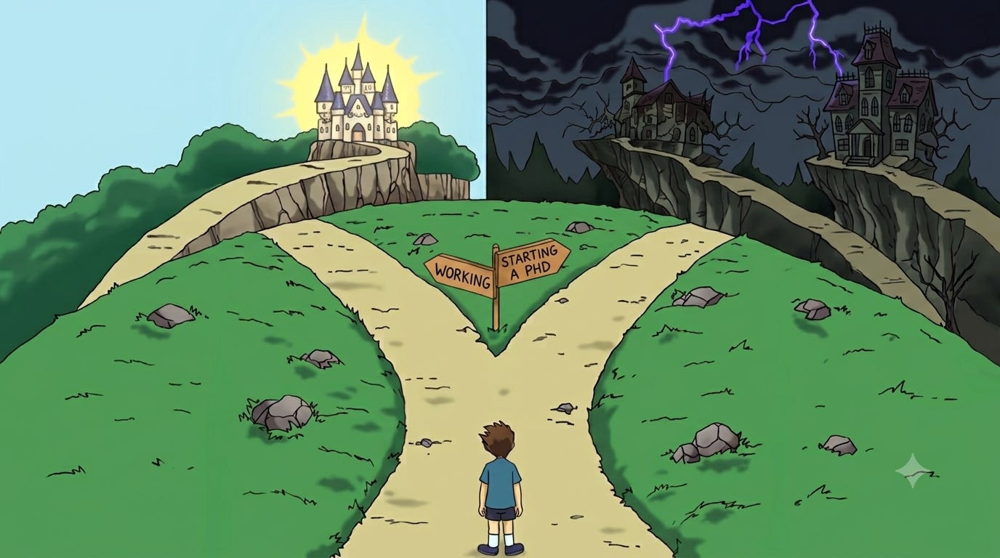
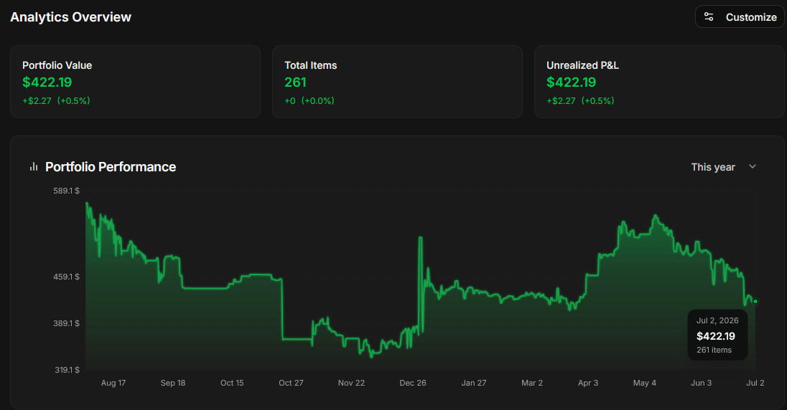

## Introduction

This is a personal post reflecting on things that have been bothering me, my past experiences, and principles I’ve learned over time. Currently, I am completing my master’s degree, as a major milestone in my life, after which I need to figure out what my next period of transformation will be, as represented in Figure 1.

_Figure 1. Meme about finishing a master's degree, standing at a crossroads between entering the workforce or pursuing a PhD status._

## Trust, but verify

You shouldn’t blindly trust everyone and everything, whether it’s information on the internet or from trusted sources, until you have researched and practiced it yourself (within legal boundaries). This doesn’t mean that you should dismiss experience of industry experts or historical materials (e.g., books, articles, videos) - it’s more about pushing yourself to think critically and to look deeper at issues from your own point of view, rather than accepting surface-level claims without questioning them. This concept of critical thinking is formally represented by [the “DYOR” (Do Your Own Research) principle](https://www.binance.com/en/academy/glossary/do-your-own-research), which applies to many fields. Instead of falling for cults like in-game skin investments, gambling, or crypto schemes - one should constantly adapt, collaborate with communities, and engage in constructive discussions for “truth-seeking” and constructing personal consensus. For example, I invested in CS:GO/CS2 items (e.g., Blast Paris Major capsules) 2–3 years ago, but I missed highest selling windows and pointlessly believed in their payback, as shown in Figure 2.

_Figure 2. My inventory portfolio from the Steamfolio dashboard, where the value dropped from $580 to $420. Also, inflation and transaction fees would leave no actual profit when cashing out from Steam through third-party services._

I was a member of a game development community for a science-fiction game in [the SCP theme](https://scp-wiki.wikidot.com/), [working as an intern game designer and UI/UX designer for about 1-2 years](https://www.behance.net/gallery/153284361/SCP-Lockdown-Protocol-Design-Concept). Most of them were in their own bubble, hating on Unity and heavily preferring Unreal Engine. I changed such imposed opinion over time, understanding that it depends on certain circumstances and not on “magical solutions”. I am no longer a game developer, but I’ve recently explored [Godot as a capable open-source game engine](https://github.com/godotengine/godot) for developing my prototypes. I like that some enthusiasts (e.g., [zool](https://x.com/ZooL_Smith/status/2071564698147827857), [333software](https://x.com/333software/status/2068847674598531448), and others) are porting entire Source-based games and modifications from GMod to it in order to avoid licensing issues from Valve, since Source is proprietary with only an SDK available. There are also cases where it is practically necessary to build custom computer simulations and engines from scratch for educational and research purposes (such as simulating network architectures, financial forecasting, or supply chain and logistics modeling) instead of relying on premade solutions. For example, you can use Raylib, as a convenient framework for non-graphics specialists, to avoid dealing with [the complexity of graphics APIs](https://www.sebastianaaltonen.com/blog/no-graphics-api), which is used by [Pufferfish AI to create training environments for agentic systems](https://youtu.be/0-y83bfAMmY).

Additionally, there is a constant flow of distracting information and manipulation that affect on people by triggering the fear of missing out and taking advantage of our collective unconscious (e.g., need for communications with others, being informed about latest things, and seeking external validation). It is not about some conspiracy theories of “evil elites controlling and dumbing down the population via addictive mechanisms”, but I think that people themselves allow narratives of consuming short clips and producing short-lived information at high speeds because society probably finds it more convenient and flexible as a form of sharing, so the state of current situation depends on each of us. This fast pace sometimes can even be beneficial when handled responsibly, as new scientific and technological discoveries shift our worldview and challenge old paradigms. From my perspective, internet and communication technologies are just middleman systems, but they contain more information and unstructured data than any single individual can comprehend, so we need some mechanisms on how to filter out this constant noise and navigate in this ocean of data. I think that AI-based filters (i.e., “smart adblock”) can help with that by automatically validating the potential intrinsic value of content and blocking or hiding it. Ideally, such a system should allow users to customize it themselves and deploy any model there (using bring-your-own-key and bring-your-own-model paradigms), instead of having closed-source recommendation systems like in social networks. Local SLMs and external LLMs as services have become alternatives to wikis and traditional search engines, because these systems distill large amounts of data into compressed representations of the world. Although they can help with practical application and active research instead of reading countless materials (e.g., tutorials, articles, and documentation), [they have inevitable training data biases](https://noyantm.substack.com/p/part-1-the-current-and-future-state) and some of their original sources are often impossible to trace in a reliable way.

## Follow your own journey

We all have limited time in this world. I don't see it from a nihilistic viewpoint, where humanity is nothing compared to the entire universe and will be forgotten anyway. Instead, I see it as a little spark of what we can accomplish in this body and spirit, passing the torch to others since the world will still exist. On this topic, I like the philosophy of Alan Watts and Buddhism, as both teach that everything is an integral part of the world and its processes - all originating from the same source of energy. I also prefer [his concept of “work as play”](https://youtube.com/shorts/p_SnV2oiHnY), in which work and leisure time are seen as something complete and not mutually exclusive. Of course, sometimes it is tedious, but it is manageable by working smarter rather than harder, and finding ways to improve your work as an artistic process rather than just performing it statically:
- Automate your own processes to optimize time, allowing machines (scripts and AI agents) to handle boilerplate and routine work.
- Maintain a project-oriented focus with limited context switching and fewer distractions.
- Mitigate stagnation periods via time-tracking and task decomposition.

Another source of inspiration I want to mention is psychologist Jordan Peterson, who talks about “the hero's journey and adventure” in his lectures, using [the biblical story of Abraham](https://youtu.be/oMBPJsPeaqo) and illustrating [the concept of following your North Star](https://youtu.be/ZwGDnSWmqhM). These are straightforward set of principles like:
- Introspect your motives and determine what actually matters deeply to you (“what do I want to do or achieve and why?”).
- Make incremental progress and iterate through rough messy drafts.
- Learn from mistakes and failures through reflection in order to refine your understanding and aim more precisely toward your goals, as shown in Figure 3.

_Figure 3. Iterative progress toward a goal. Our journey is a process of continuous adaptation and transformations with both mistakes and improvements._

Personally, I struggled with iterating because I spent too much time trapped in theory and analysis paralysis (e.g., trying to find better programming language, frameworks, libraries, patterns, and so on) instead of getting actual practice, which can result in endless rabbit holes and absence useful/applied knowledge. I realize that one should create more than consume like following 80/20 rule (80% practice and 20% theory). For example, Casey Muratori, a well-known game developer, [noted in his interviews that “you are either playing basketball or watching it”](https://youtu.be/S_JBMqh5eQo), so this metaphor means that you are either actively doing something yourself or just like watching others do it. I also think [there’s no point in passively hoarding too much information](https://zettelkasten.de/posts/collectors-fallacy/) or reading things that will quickly become outdated, although it is still important to stay up to date with the cutting edge.

Obviously, there are things that are completely out of our control and beyond our influence, since the world consists of chaos, unfairness, noise, randomness, and complexity. However, we can try to change our attitude toward what we can control and adjust our behavior as well. Firstly, [Jim Carrey shares the idea that depression (not the medical kind) and a state of weakness happen when the self needs “deep rest”](https://youtube.com/shorts/lMQJ2bHeP4c), meaning our social mask or role doesn’t represent our true nature and the subconscious identifies it as a useless burden. Secondly, there’s no point in comparing yourself to others or creating ideal idols - try to form relationships and collaborate instead. Thirdly, you should view things objectively from a game theory perspective by minding your own business and taking others into account.

## Getting things done

It's easy to start a project, but finishing it to a reasonable milestone or a “final” state is usually extremely hard. I have a whole graveyard of unfinished projects that were meant to solve some problem, but along the way, I either gave up on them or left them in a half-finished state (maybe it is my bad habit of avoiding things). I’ve heard that other people deal with this through hackathons, where they can build the satisfaction of completing small prototypes and later combine or recycle those pieces into a full-scale project. However, it didn’t work for me because I tend to over-plan; I realize now that writing something like a 100-page design document in a waterfall approach is impractical and harmful for solving real problems:
- Try to ship at least something, and if it is really bad, allocate more time and resources to polish and refactor it to an acceptable state.
- Giving your projects a name helps them stick around and gives you a greater sense of purpose while working on them.
- Background experience from other domains and fields can be useful at any moment, providing a broader perspective and a more creative approach for solving problems.

You should narrow down the number of active projects you take on, because it's impossible for one person to handle too many things simultaneously with same quality (of course without vibe coding scenarios). For instance, Jonathan Blow, the creator of Braid and The Witness, spent 10 years working on a single game, a custom engine, and his own programming language (I recommend you to check out [his “Order of the Sinking Star” demo](https://store.steampowered.com/app/4597250/Order_of_the_Sinking_Star_Demo/)). There are also other crucial specialists who have made only a few projects, but those projects were foundational to the entire IT industry:
- Linus Torvalds (Linux and Git)
- Richard Stallman (GNU)
- Fabrice Bellard (FFmpeg)
- Igor Sysoev (Nginx)
- D. Richard Hipp (SQLite)
- Chris Lattner (LLVM)
- And many others…

Iterate and simplify without getting trapped in the illusion of a “perfect system” and “clean architecture”. It's impossible to design and implement everything perfectly in advance and account for every single factor and requirement, which is why you need to build and review incrementally with keeping things simple (e.g., functions instead of complex class hierarchy, single file instead of multiple ones, minimal amount of dependencies), as demonstrated in Figure 4. In such case, any system evolves naturally with feedback loop from users and gradually adding formal practices (standards, security measures, analysis, testing, etc.). Furthermore, there is a growing realization today that software development must be judged by math and physics at low levels of abstraction, free from imposed preconceptions and with real experiments or empirical measurements.

_Figure 4. [Simplicity over complexity and abstractions](https://youtu.be/6jaVyckxjsA). This doesn’t mean we don’t need abstractions at all - we do but only those that are [stable and useful](https://en.wikipedia.org/wiki/Worse_is_better) (like the Unix TTY, file, and process abstractions). There is actually a video on this exact topic about how we can [reinvent low-level abstractions to be more human-oriented](https://youtu.be/AmrBpxAtPrI)._

## Conclusion

> Mick Gordon at GDC 2017: “Change the process, change the outcome”.

There's nothing else important left to say, since everything else is up to me and you now. I don’t want to become an influencer by publishing these articles, so my next posts will be more focused on the practical side and write-ups, as [I need to shift my career focus](https://m.youtube.com/watch?v=QqgaJb601Ts) and personal vision from theory to practice:
- We aren't doing foundational AI in Kazakhstan and just fine-tuning existing models. That's exactly why I want to master GPU programming and building AI agentic systems to help push this field forward locally. So, I need to deepen my knowledge of C/C++, low-level systems programming, and upgrade my math skills. Also, I wanna try to pass [HTB Certified Offensive AI Expert certification](https://academy.hackthebox.com/preview/certifications/htb-certified-offensive-ai-expert) and check list of other cybersecurity practices (from [lainkusanagi](https://docs.google.com/spreadsheets/d/18weuz_Eeynr6sXFQ87Cd5F0slOj9Z6rt) and [tj_null](https://docs.google.com/spreadsheets/u/1/d/1dwSMIAPIam0PuRBkCiDI88pU3yzrqqHkDtBngUHNCw8)).
- Create a community around my dissertation topic with a 100 KLoC project solving real issues in software supply chain security and enhancing cybersecurity posture of IT industry. The first step will be to propose my solution to the PyPI ecosystem, [starting with discussions](https://discuss.python.org/latest) and [forming a formal PEP for the Python](https://peps.python.org/pep-0000/) programming language.
- I haven't achieved any major success yet, and I want to lift myself out of poverty - not just for my own sake, but to be useful to others by reinvesting funds back into our economy and startups.
